Manpower Planning
================
Andhyka Cakrabuana Adhitama
- 1/11/2022

# Preparation

``` r
library(scales)
library(rlang)
library(lazyeval)
```

    ## 
    ## Attaching package: 'lazyeval'

    ## The following objects are masked from 'package:rlang':
    ## 
    ##     as_name, call_modify, call_standardise, expr_label, expr_text,
    ##     f_env, f_env<-, f_label, f_lhs, f_lhs<-, f_rhs, f_rhs<-, f_text,
    ##     is_atomic, is_call, is_formula, is_lang, is_pairlist, missing_arg

``` r
library(ggplot2)
library(fpp2)
```

    ## Registered S3 method overwritten by 'quantmod':
    ##   method            from
    ##   as.zoo.data.frame zoo

    ## -- Attaching packages ---------------------------------------------- fpp2 2.4 --

    ## v forecast  8.15     v expsmooth 2.3 
    ## v fma       2.4

    ## 

``` r
library(readxl)

df_prod <- read.csv("https://raw.githubusercontent.com/dhykac/manpower_planning/main/df_productivity.csv")
summary(df_prod)
```

    ##      DATE              INB.PROD       INBOUND        INTERNAL     
    ##  Length:29          Min.   :  24   Min.   : 151   Min.   :  48.0  
    ##  Class :character   1st Qu.: 748   1st Qu.:2441   1st Qu.: 303.0  
    ##  Mode  :character   Median :1702   Median :3062   Median : 434.0  
    ##                     Mean   :1449   Mean   :2908   Mean   : 426.5  
    ##                     3rd Qu.:2082   3rd Qu.:3517   3rd Qu.: 531.0  
    ##                     Max.   :2347   Max.   :4492   Max.   :1004.0  
    ##      NARROW        NARROW.OUT      NARROW.RPL      O.PND.OUT    
    ##  Min.   :  4.0   Min.   : 41.0   Min.   : 3.00   Min.   :  7.0  
    ##  1st Qu.:196.0   1st Qu.:201.0   1st Qu.:12.00   1st Qu.:172.0  
    ##  Median :299.0   Median :304.0   Median :16.00   Median :208.0  
    ##  Mean   :269.3   Mean   :275.8   Mean   :17.69   Mean   :218.9  
    ##  3rd Qu.:330.0   3rd Qu.:355.0   3rd Qu.:23.00   3rd Qu.:265.0  
    ##  Max.   :550.0   Max.   :458.0   Max.   :45.00   Max.   :512.0  
    ##     OUT.CONT         OUTBOUND   
    ##  Min.   :  10.0   Min.   : 361  
    ##  1st Qu.: 742.0   1st Qu.:1608  
    ##  Median : 836.0   Median :2018  
    ##  Mean   : 855.6   Mean   :1841  
    ##  3rd Qu.:1049.0   3rd Qu.:2133  
    ##  Max.   :1474.0   Max.   :2572

``` r
View(df_prod)
```

# INB-PROD

``` r
Yinp <- ts(df_prod[,2])
autoplot(Yinp) + ggtitle("Time Series Plot : INB-PROD") + ylab("Sum of Pallets")
```

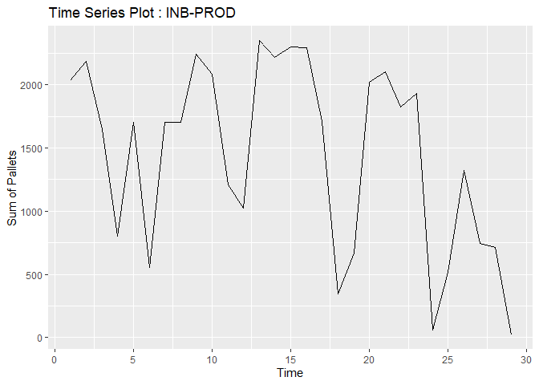<!-- -->
#### As we can see, the data had a trend so we will made new data with
added differencing method.

``` r
DYinp <- diff(Yinp)
autoplot(DYinp) + ggtitle("Time Series Plot : INB-PROD with diff") + ylab("Sum of Pallets")
```

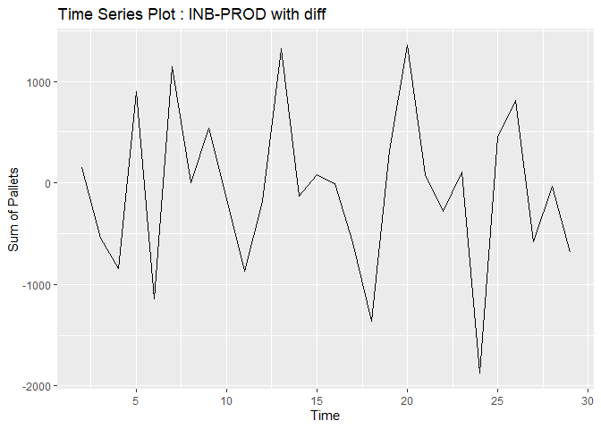<!-- -->
#### The data didn’t have seasonal. So we could go to next step for
determine best model.

``` r
fit <- naive(DYinp)
print(summary(fit))
```

    ## 
    ## Forecast method: Naive method
    ## 
    ## Model Information:
    ## Call: naive(y = DYinp) 
    ## 
    ## Residual sd: 1207.348 
    ## 
    ## Error measures:
    ##                     ME     RMSE      MAE       MPE    MAPE MASE       ACF1
    ## Training set -31.25926 1207.348 1016.519 -4140.386 4598.59    1 -0.5041858
    ## 
    ## Forecasts:
    ##    Point Forecast     Lo 80     Hi 80     Lo 95    Hi 95
    ## 30           -689 -2236.279  858.2787 -3055.359 1677.359
    ## 31           -689 -2877.182 1499.1825 -4035.536 2657.536
    ## 32           -689 -3368.965 1990.9653 -4787.653 3409.653
    ## 33           -689 -3783.557 2405.5574 -5421.717 4043.717
    ## 34           -689 -4148.820 2770.8203 -5980.339 4602.339
    ## 35           -689 -4479.043 3101.0432 -6485.371 5107.371
    ## 36           -689 -4782.715 3404.7146 -6949.796 5571.796
    ## 37           -689 -5065.365 3687.3650 -7382.073 6004.073
    ## 38           -689 -5330.836 3952.8360 -7788.076 6410.076
    ## 39           -689 -5581.925 4203.9248 -8172.083 6794.083

``` r
checkresiduals(fit)
```

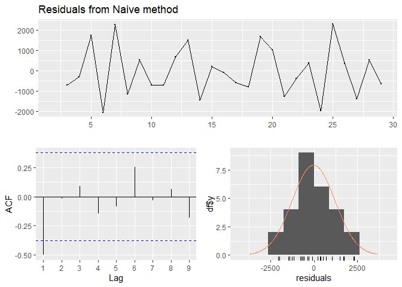<!-- -->

    ## 
    ##  Ljung-Box test
    ## 
    ## data:  Residuals from Naive method
    ## Q* = 11.343, df = 6, p-value = 0.07832
    ## 
    ## Model df: 0.   Total lags used: 6

``` r
## Residuals = 1208

fit_ets <- ets(Yinp)
print(summary(fit_ets))
```

    ## ETS(M,N,N) 
    ## 
    ## Call:
    ##  ets(y = Yinp) 
    ## 
    ##   Smoothing parameters:
    ##     alpha = 0.2585 
    ## 
    ##   Initial states:
    ##     l = 1542.3899 
    ## 
    ##   sigma:  0.4792
    ## 
    ##      AIC     AICc      BIC 
    ## 484.3477 485.3077 488.4496 
    ## 
    ## Training set error measures:
    ##                     ME     RMSE      MAE       MPE     MAPE     MASE     ACF1
    ## Training set -109.0727 712.1233 603.5252 -262.6421 286.7469 1.021008 0.228689

``` r
checkresiduals(fit_ets)
```

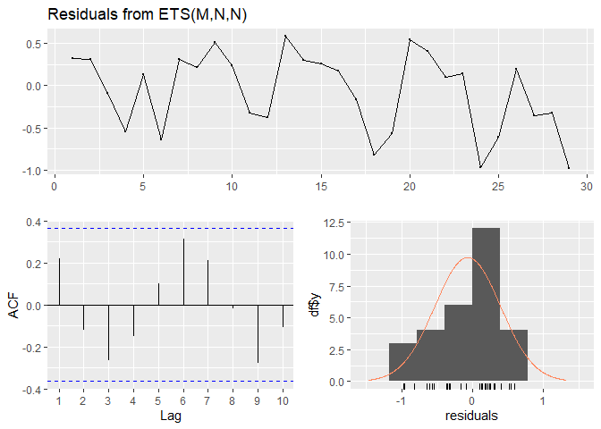<!-- -->

    ## 
    ##  Ljung-Box test
    ## 
    ## data:  Residuals from ETS(M,N,N)
    ## Q* = 9.4489, df = 4, p-value = 0.05081
    ## 
    ## Model df: 2.   Total lags used: 6

``` r
## Residuals = 713

fit_arima <- auto.arima(DYinp, d=0, D=0, stepwise = FALSE, approximation = FALSE, trace = TRUE)
```

    ## 
    ##  ARIMA(0,0,0) with zero mean     : 454.0396
    ##  ARIMA(0,0,0) with non-zero mean : 456.124
    ##  ARIMA(0,0,1) with zero mean     : 453.3351
    ##  ARIMA(0,0,1) with non-zero mean : 454.519
    ##  ARIMA(0,0,2) with zero mean     : 452.7407
    ##  ARIMA(0,0,2) with non-zero mean : Inf
    ##  ARIMA(0,0,3) with zero mean     : 455.3701
    ##  ARIMA(0,0,3) with non-zero mean : Inf
    ##  ARIMA(0,0,4) with zero mean     : Inf
    ##  ARIMA(0,0,4) with non-zero mean : Inf
    ##  ARIMA(0,0,5) with zero mean     : Inf
    ##  ARIMA(0,0,5) with non-zero mean : Inf
    ##  ARIMA(1,0,0) with zero mean     : 455.334
    ##  ARIMA(1,0,0) with non-zero mean : 457.5222
    ##  ARIMA(1,0,1) with zero mean     : 453.1091
    ##  ARIMA(1,0,1) with non-zero mean : Inf
    ##  ARIMA(1,0,2) with zero mean     : 455.4153
    ##  ARIMA(1,0,2) with non-zero mean : Inf
    ##  ARIMA(1,0,3) with zero mean     : 458.3514
    ##  ARIMA(1,0,3) with non-zero mean : Inf
    ##  ARIMA(1,0,4) with zero mean     : 461.63
    ##  ARIMA(1,0,4) with non-zero mean : Inf
    ##  ARIMA(2,0,0) with zero mean     : 456.6571
    ##  ARIMA(2,0,0) with non-zero mean : 458.9605
    ##  ARIMA(2,0,1) with zero mean     : 455.0421
    ##  ARIMA(2,0,1) with non-zero mean : Inf
    ##  ARIMA(2,0,2) with zero mean     : Inf
    ##  ARIMA(2,0,2) with non-zero mean : Inf
    ##  ARIMA(2,0,3) with zero mean     : Inf
    ##  ARIMA(2,0,3) with non-zero mean : Inf
    ##  ARIMA(3,0,0) with zero mean     : 458.0465
    ##  ARIMA(3,0,0) with non-zero mean : 460.5526
    ##  ARIMA(3,0,1) with zero mean     : 456.9538
    ##  ARIMA(3,0,1) with non-zero mean : 458.8053
    ##  ARIMA(3,0,2) with zero mean     : Inf
    ##  ARIMA(3,0,2) with non-zero mean : Inf
    ##  ARIMA(4,0,0) with zero mean     : 456.6327
    ##  ARIMA(4,0,0) with non-zero mean : 458.9529
    ##  ARIMA(4,0,1) with zero mean     : 458.0754
    ##  ARIMA(4,0,1) with non-zero mean : 460.1598
    ##  ARIMA(5,0,0) with zero mean     : 456.5436
    ##  ARIMA(5,0,0) with non-zero mean : 458.4851
    ## 
    ## 
    ## 
    ##  Best model: ARIMA(0,0,2) with zero mean

``` r
print(summary(fit_arima))
```

    ## Series: DYinp 
    ## ARIMA(0,0,2) with zero mean 
    ## 
    ## Coefficients:
    ##           ma1      ma2
    ##       -0.4546  -0.3074
    ## s.e.   0.1855   0.1704
    ## 
    ## sigma^2 estimated as 502987:  log likelihood=-222.87
    ## AIC=451.74   AICc=452.74   BIC=455.74
    ## 
    ## Training set error measures:
    ##                     ME     RMSE     MAE       MPE     MAPE      MASE
    ## Training set -150.0653 683.4174 539.912 -178.3821 422.7748 0.5311383
    ##                     ACF1
    ## Training set -0.03624902

``` r
checkresiduals(fit_arima)
```

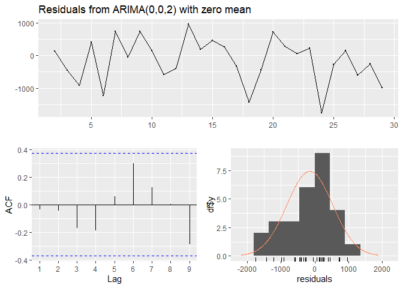<!-- -->

    ## 
    ##  Ljung-Box test
    ## 
    ## data:  Residuals from ARIMA(0,0,2) with zero mean
    ## Q* = 5.783, df = 4, p-value = 0.2159
    ## 
    ## Model df: 2.   Total lags used: 6

``` r
## Residuals = 710
## Residuals diff 2 = 779
```

#### The best model for this one is ARIMA, since the model had smallest residuals.

``` r
fcast <- forecast(fit_arima, h=3)
autoplot(fcast)
```

<!-- -->

``` r
print(summary(fcast))
```

    ## 
    ## Forecast method: ARIMA(0,0,2) with zero mean
    ## 
    ## Model Information:
    ## Series: DYinp 
    ## ARIMA(0,0,2) with zero mean 
    ## 
    ## Coefficients:
    ##           ma1      ma2
    ##       -0.4546  -0.3074
    ## s.e.   0.1855   0.1704
    ## 
    ## sigma^2 estimated as 502987:  log likelihood=-222.87
    ## AIC=451.74   AICc=452.74   BIC=455.74
    ## 
    ## Error measures:
    ##                     ME     RMSE     MAE       MPE     MAPE      MASE
    ## Training set -150.0653 683.4174 539.912 -178.3821 422.7748 0.5311383
    ##                     ACF1
    ## Training set -0.03624902
    ## 
    ## Forecasts:
    ##    Point Forecast      Lo 80    Hi 80      Lo 95    Hi 95
    ## 30       528.8416  -380.0569 1437.740  -861.1986 1918.882
    ## 31       303.9202  -694.4938 1302.334 -1223.0222 1830.863
    ## 32         0.0000 -1036.7782 1036.778 -1585.6154 1585.615

#### Forecast workload for next day with confidence 95% is 1919 pallets.

# INBOUND

``` r
Yinc <- ts(df_prod[,3])
autoplot(Yinc) + ggtitle("Time Series Plot : INBOUND") + ylab("Sum of Pallets")
```

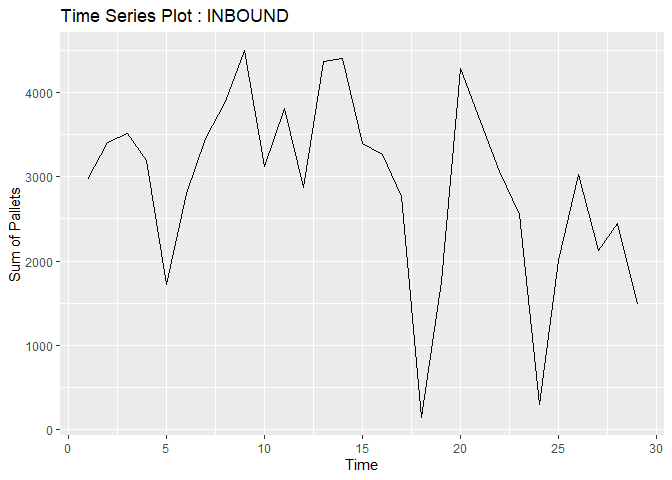<!-- -->
#### As we can see, the data had a trend so we will made new data with
added differencing method.

``` r
DYinc <- diff(Yinc)
autoplot(DYinc) + ggtitle("Time Series Plot : INBOUND with diff") + ylab("Sum of Pallets")
```

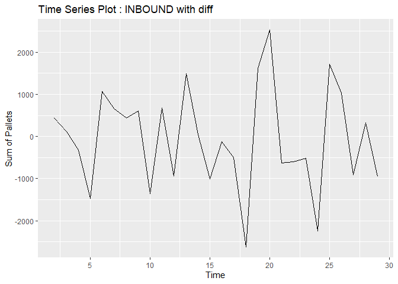<!-- -->
#### The data didn’t have seasonal. So we could go to next step for
determine best model.

``` r
fit <- naive(DYinc)
print(summary(fit))
```

    ## 
    ## Forecast method: Naive method
    ## 
    ## Model Information:
    ## Call: naive(y = DYinc) 
    ## 
    ## Residual sd: 1806.9593 
    ## 
    ## Error measures:
    ##                     ME     RMSE      MAE       MPE    MAPE MASE       ACF1
    ## Training set -51.33333 1806.959 1422.148 -40.92628 289.748    1 -0.4283156
    ## 
    ## Forecasts:
    ##    Point Forecast     Lo 80    Hi 80      Lo 95     Hi 95
    ## 30           -951 -3266.711 1364.711  -4492.575  2590.575
    ## 31           -951 -4225.911 2323.911  -5959.544  4057.544
    ## 32           -951 -4961.930 3059.930  -7085.188  5183.188
    ## 33           -951 -5582.423 3680.423  -8034.150  6132.150
    ## 34           -951 -6129.088 4227.088  -8870.203  6968.203
    ## 35           -951 -6623.311 4721.311  -9626.052  7724.052
    ## 36           -951 -7077.797 5175.797 -10321.127  8419.127
    ## 37           -951 -7500.821 5598.821 -10968.087  9066.087
    ## 38           -951 -7898.134 5996.134 -11575.725  9673.725
    ## 39           -951 -8273.923 6371.923 -12150.444 10248.444

``` r
checkresiduals(fit)
```

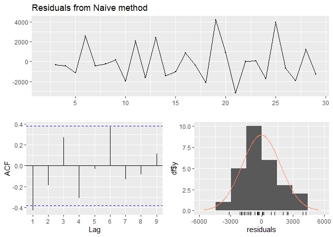<!-- -->

    ## 
    ##  Ljung-Box test
    ## 
    ## data:  Residuals from Naive method
    ## Q* = 17.368, df = 6, p-value = 0.008023
    ## 
    ## Model df: 0.   Total lags used: 6

``` r
## Residuals = 1806

fit_ets <- ets(Yinc)
print(summary(fit_ets))
```

    ## ETS(M,N,N) 
    ## 
    ## Call:
    ##  ets(y = Yinc) 
    ## 
    ##   Smoothing parameters:
    ##     alpha = 0.1536 
    ## 
    ##   Initial states:
    ##     l = 2874.8681 
    ## 
    ##   sigma:  0.3589
    ## 
    ##      AIC     AICc      BIC 
    ## 506.7157 507.6757 510.8176 
    ## 
    ## Training set error measures:
    ##                     ME     RMSE      MAE       MPE     MAPE      MASE      ACF1
    ## Training set -119.8268 1068.267 781.0304 -108.9612 125.8087 0.8126059 0.2985748

``` r
checkresiduals(fit_ets)
```

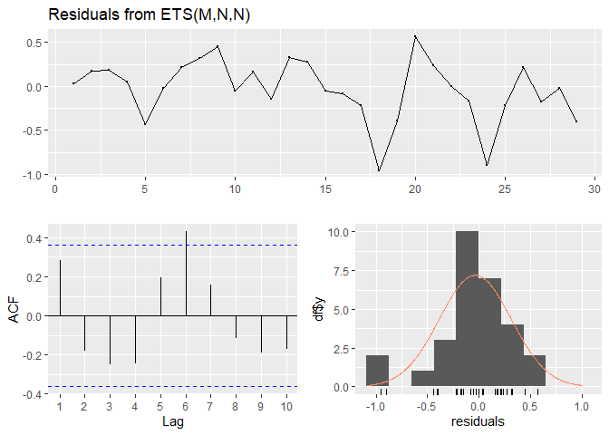<!-- -->

    ## 
    ##  Ljung-Box test
    ## 
    ## data:  Residuals from ETS(M,N,N)
    ## Q* = 16.709, df = 4, p-value = 0.002202
    ## 
    ## Model df: 2.   Total lags used: 6

``` r
## Residuals = 1069

fit_arima <- auto.arima(DYinc, d=0, D=0, stepwise = FALSE, approximation = FALSE, trace = TRUE)
```

    ## 
    ##  ARIMA(0,0,0) with zero mean     : 477.7321
    ##  ARIMA(0,0,0) with non-zero mean : 480.0021
    ##  ARIMA(0,0,1) with zero mean     : 476.1677
    ##  ARIMA(0,0,1) with non-zero mean : Inf
    ##  ARIMA(0,0,2) with zero mean     : 474.0089
    ##  ARIMA(0,0,2) with non-zero mean : Inf
    ##  ARIMA(0,0,3) with zero mean     : 476.556
    ##  ARIMA(0,0,3) with non-zero mean : Inf
    ##  ARIMA(0,0,4) with zero mean     : 479.3156
    ##  ARIMA(0,0,4) with non-zero mean : Inf
    ##  ARIMA(0,0,5) with zero mean     : 480.7735
    ##  ARIMA(0,0,5) with non-zero mean : Inf
    ##  ARIMA(1,0,0) with zero mean     : 479.4757
    ##  ARIMA(1,0,0) with non-zero mean : 481.9263
    ##  ARIMA(1,0,1) with zero mean     : 475.6147
    ##  ARIMA(1,0,1) with non-zero mean : Inf
    ##  ARIMA(1,0,2) with zero mean     : 476.5792
    ##  ARIMA(1,0,2) with non-zero mean : Inf
    ##  ARIMA(1,0,3) with zero mean     : 479.5672
    ##  ARIMA(1,0,3) with non-zero mean : Inf
    ##  ARIMA(1,0,4) with zero mean     : 482.7997
    ##  ARIMA(1,0,4) with non-zero mean : Inf
    ##  ARIMA(2,0,0) with zero mean     : 479.2171
    ##  ARIMA(2,0,0) with non-zero mean : 481.8245
    ##  ARIMA(2,0,1) with zero mean     : 476.5509
    ##  ARIMA(2,0,1) with non-zero mean : Inf
    ##  ARIMA(2,0,2) with zero mean     : 479.5668
    ##  ARIMA(2,0,2) with non-zero mean : Inf
    ##  ARIMA(2,0,3) with zero mean     : Inf
    ##  ARIMA(2,0,3) with non-zero mean : Inf
    ##  ARIMA(3,0,0) with zero mean     : 481.3585
    ##  ARIMA(3,0,0) with non-zero mean : 484.1942
    ##  ARIMA(3,0,1) with zero mean     : 479.1898
    ##  ARIMA(3,0,1) with non-zero mean : Inf
    ##  ARIMA(3,0,2) with zero mean     : 482.5428
    ##  ARIMA(3,0,2) with non-zero mean : Inf
    ##  ARIMA(4,0,0) with zero mean     : 475.1125
    ##  ARIMA(4,0,0) with non-zero mean : 478.0982
    ##  ARIMA(4,0,1) with zero mean     : 476.7469
    ##  ARIMA(4,0,1) with non-zero mean : 479.7254
    ##  ARIMA(5,0,0) with zero mean     : 475.5013
    ##  ARIMA(5,0,0) with non-zero mean : 478.3648
    ## 
    ## 
    ## 
    ##  Best model: ARIMA(0,0,2) with zero mean

``` r
print(summary(fit_arima))
```

    ## Series: DYinc 
    ## ARIMA(0,0,2) with zero mean 
    ## 
    ## Coefficients:
    ##           ma1      ma2
    ##       -0.3758  -0.4427
    ## s.e.   0.1960   0.1910
    ## 
    ## sigma^2 estimated as 1064370:  log likelihood=-233.5
    ## AIC=473.01   AICc=474.01   BIC=477.01
    ## 
    ## Training set error measures:
    ##                    ME     RMSE     MAE     MPE    MAPE      MASE        ACF1
    ## Training set -141.536 994.1548 713.734 91.6835 91.6835 0.5018704 -0.06370472

``` r
checkresiduals(fit_arima)
```

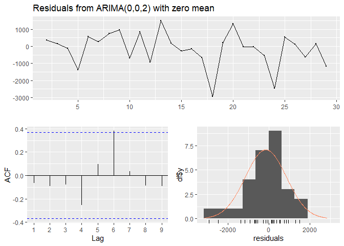<!-- -->

    ## 
    ##  Ljung-Box test
    ## 
    ## data:  Residuals from ARIMA(0,0,2) with zero mean
    ## Q* = 8.7218, df = 4, p-value = 0.06844
    ## 
    ## Model df: 2.   Total lags used: 6

``` r
## Residuals = 1032
## Residuals diff 2 = 1108
```

#### The best model for this one is ARIMA, since the model had smallest residuals.

``` r
fcast <- forecast(fit_arima, h=3)
autoplot(fcast)
```

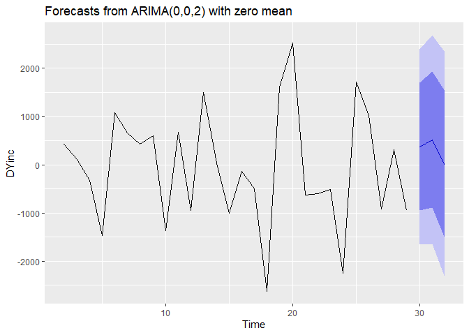<!-- -->

``` r
print(summary(fcast))
```

    ## 
    ## Forecast method: ARIMA(0,0,2) with zero mean
    ## 
    ## Model Information:
    ## Series: DYinc 
    ## ARIMA(0,0,2) with zero mean 
    ## 
    ## Coefficients:
    ##           ma1      ma2
    ##       -0.3758  -0.4427
    ## s.e.   0.1960   0.1910
    ## 
    ## sigma^2 estimated as 1064370:  log likelihood=-233.5
    ## AIC=473.01   AICc=474.01   BIC=477.01
    ## 
    ## Error measures:
    ##                    ME     RMSE     MAE     MPE    MAPE      MASE        ACF1
    ## Training set -141.536 994.1548 713.734 91.6835 91.6835 0.5018704 -0.06370472
    ## 
    ## Forecasts:
    ##    Point Forecast      Lo 80    Hi 80     Lo 95    Hi 95
    ## 30       374.2757  -947.9521 1696.504 -1647.897 2396.449
    ## 31       517.6361  -894.8125 1930.085 -1642.518 2677.790
    ## 32         0.0000 -1528.9227 1528.923 -2338.285 2338.285

#### Forecast workload for next day with confidence 95% is 2397 pallets.

# INTERNAL

``` r
Yint <- ts(df_prod[,4])
autoplot(Yint) + ggtitle("Time Series Plot : INTERNAL") + ylab("Sum of Pallets")
```

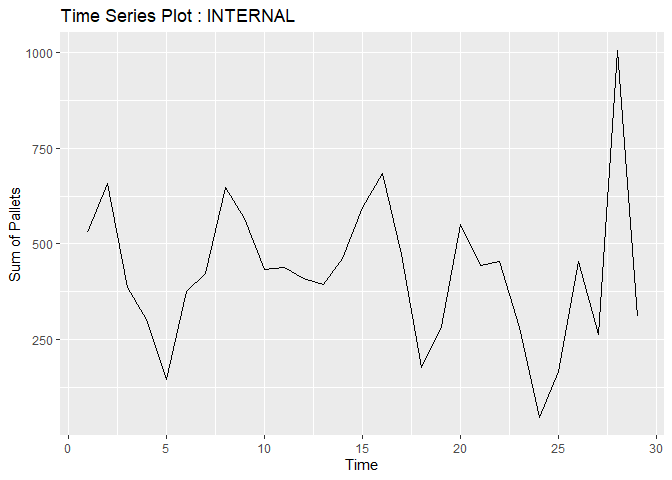<!-- -->
#### As we can see, the data had a trend so we will made new data with
added differencing method.

``` r
DYint <- diff(Yint)
autoplot(DYint) + ggtitle("Time Series Plot : INTERNAL with diff") + ylab("Sum of Pallets")
```

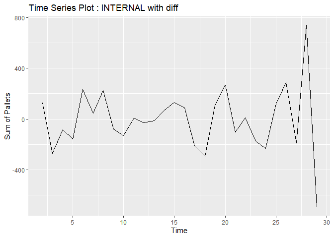<!-- -->
#### The data didn’t have seasonal. So we could go to next step for
determine best model.

``` r
fit <- naive(DYint)
print(summary(fit))
```

    ## 
    ## Forecast method: Naive method
    ## 
    ## Model Information:
    ## Call: naive(y = DYint) 
    ## 
    ## Residual sd: 399.5217 
    ## 
    ## Error measures:
    ##                     ME     RMSE     MAE      MPE     MAPE MASE       ACF1
    ## Training set -30.33333 399.5217 266.037 236.8326 295.4131    1 -0.4895987
    ## 
    ## Forecasts:
    ##    Point Forecast     Lo 80      Hi 80     Lo 95      Hi 95
    ## 30           -692 -1204.008 -179.99233 -1475.048   91.04815
    ## 31           -692 -1416.088   32.08819 -1799.397  415.39732
    ## 32           -692 -1578.823  194.82329 -2048.279  664.27918
    ## 33           -692 -1716.015  332.01533 -2258.096  874.09630
    ## 34           -692 -1836.884  452.88395 -2442.949 1058.94890
    ## 35           -692 -1946.158  562.15753 -2610.068 1226.06842
    ## 36           -692 -2046.645  662.64495 -2763.751 1379.75068
    ## 37           -692 -2140.176  756.17637 -2906.795 1522.79463
    ## 38           -692 -2228.023  844.02300 -3041.144 1657.14446
    ## 39           -692 -2311.110  927.11040 -3168.216 1784.21568

``` r
checkresiduals(fit)
```

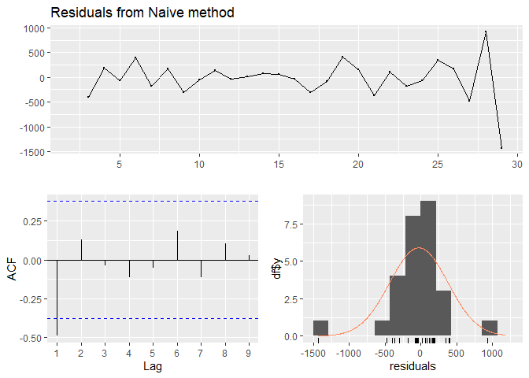<!-- -->

    ## 
    ##  Ljung-Box test
    ## 
    ## data:  Residuals from Naive method
    ## Q* = 9.6037, df = 6, p-value = 0.1424
    ## 
    ## Model df: 0.   Total lags used: 6

``` r
## Residuals = 400

fit_ets <- ets(Yint)
print(summary(fit_ets))
```

    ## ETS(A,N,N) 
    ## 
    ## Call:
    ##  ets(y = Yint) 
    ## 
    ##   Smoothing parameters:
    ##     alpha = 1e-04 
    ## 
    ##   Initial states:
    ##     l = 426.5376 
    ## 
    ##   sigma:  195.8823
    ## 
    ##      AIC     AICc      BIC 
    ## 407.6751 408.6351 411.7770 
    ## 
    ## Training set error measures:
    ##                       ME     RMSE      MAE       MPE     MAPE      MASE
    ## Training set -0.07084547 189.0071 137.9831 -43.44883 64.00257 0.7544476
    ##                   ACF1
    ## Training set 0.1431771

``` r
checkresiduals(fit_ets)
```

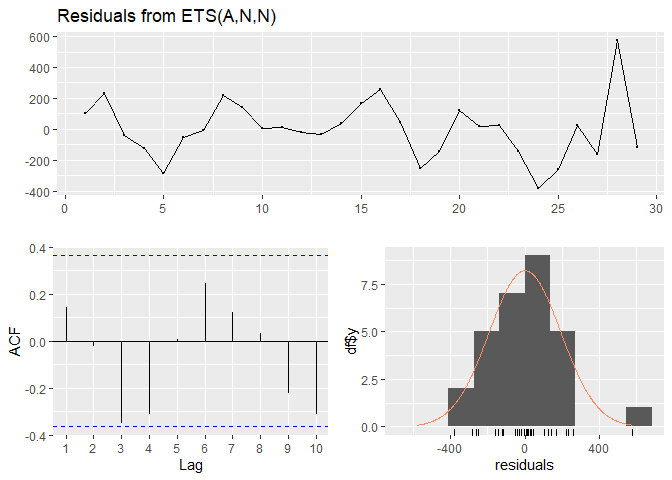<!-- -->

    ## 
    ##  Ljung-Box test
    ## 
    ## data:  Residuals from ETS(A,N,N)
    ## Q* = 10.827, df = 4, p-value = 0.02857
    ## 
    ## Model df: 2.   Total lags used: 6

``` r
## Residuals = 189

fit_arima <- auto.arima(DYint, d=0, D=0, stepwise = FALSE, approximation = FALSE, trace = TRUE)
```

    ## 
    ##  ARIMA(0,0,0) with zero mean     : 390.8339
    ##  ARIMA(0,0,0) with non-zero mean : 393.1327
    ##  ARIMA(0,0,1) with zero mean     : Inf
    ##  ARIMA(0,0,1) with non-zero mean : Inf
    ##  ARIMA(0,0,2) with zero mean     : Inf
    ##  ARIMA(0,0,2) with non-zero mean : Inf
    ##  ARIMA(0,0,3) with zero mean     : Inf
    ##  ARIMA(0,0,3) with non-zero mean : Inf
    ##  ARIMA(0,0,4) with zero mean     : Inf
    ##  ARIMA(0,0,4) with non-zero mean : Inf
    ##  ARIMA(0,0,5) with zero mean     : Inf
    ##  ARIMA(0,0,5) with non-zero mean : Inf
    ##  ARIMA(1,0,0) with zero mean     : 387.4572
    ##  ARIMA(1,0,0) with non-zero mean : 389.9755
    ##  ARIMA(1,0,1) with zero mean     : Inf
    ##  ARIMA(1,0,1) with non-zero mean : Inf
    ##  ARIMA(1,0,2) with zero mean     : Inf
    ##  ARIMA(1,0,2) with non-zero mean : Inf
    ##  ARIMA(1,0,3) with zero mean     : Inf
    ##  ARIMA(1,0,3) with non-zero mean : Inf
    ##  ARIMA(1,0,4) with zero mean     : 386.3619
    ##  ARIMA(1,0,4) with non-zero mean : Inf
    ##  ARIMA(2,0,0) with zero mean     : 389.9206
    ##  ARIMA(2,0,0) with non-zero mean : 392.6583
    ##  ARIMA(2,0,1) with zero mean     : Inf
    ##  ARIMA(2,0,1) with non-zero mean : Inf
    ##  ARIMA(2,0,2) with zero mean     : Inf
    ##  ARIMA(2,0,2) with non-zero mean : Inf
    ##  ARIMA(2,0,3) with zero mean     : Inf
    ##  ARIMA(2,0,3) with non-zero mean : Inf
    ##  ARIMA(3,0,0) with zero mean     : Inf
    ##  ARIMA(3,0,0) with non-zero mean : Inf
    ##  ARIMA(3,0,1) with zero mean     : Inf
    ##  ARIMA(3,0,1) with non-zero mean : Inf
    ##  ARIMA(3,0,2) with zero mean     : Inf
    ##  ARIMA(3,0,2) with non-zero mean : Inf
    ##  ARIMA(4,0,0) with zero mean     : 386.1892
    ##  ARIMA(4,0,0) with non-zero mean : 389.4585
    ##  ARIMA(4,0,1) with zero mean     : 385.245
    ##  ARIMA(4,0,1) with non-zero mean : 388.7446
    ##  ARIMA(5,0,0) with zero mean     : 384.5303
    ##  ARIMA(5,0,0) with non-zero mean : 388.1232
    ## 
    ## 
    ## 
    ##  Best model: ARIMA(5,0,0) with zero mean

``` r
print(summary(fit_arima))
```

    ## Series: DYint 
    ## ARIMA(5,0,0) with zero mean 
    ## 
    ## Coefficients:
    ##           ar1      ar2      ar3      ar4      ar5
    ##       -0.7946  -0.4558  -0.6206  -0.7829  -0.5411
    ## s.e.   0.1620   0.2278   0.1730   0.1854   0.2125
    ## 
    ## sigma^2 estimated as 32811:  log likelihood=-184.27
    ## AIC=380.53   AICc=384.53   BIC=388.52
    ## 
    ## Training set error measures:
    ##                     ME     RMSE      MAE     MPE     MAPE     MASE      ACF1
    ## Training set -9.999187 164.1709 130.4651 65.0792 298.6644 0.490402 -0.043742

``` r
checkresiduals(fit_arima)
```

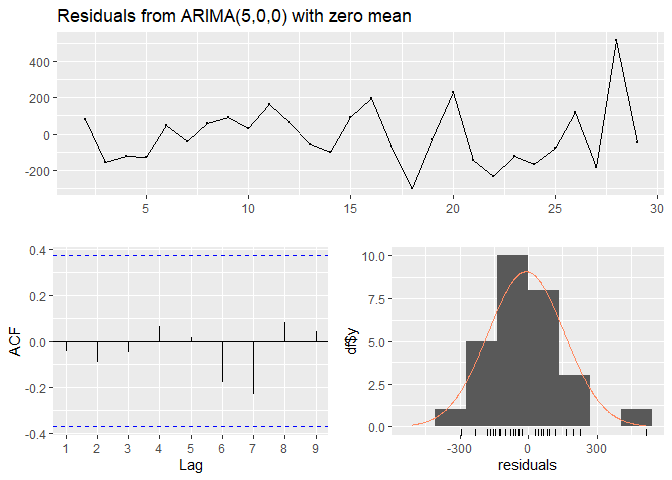<!-- -->

    ## 
    ##  Ljung-Box test
    ## 
    ## data:  Residuals from ARIMA(5,0,0) with zero mean
    ## Q* = 4.2149, df = 3, p-value = 0.2392
    ## 
    ## Model df: 5.   Total lags used: 8

``` r
## Residuals = 182
## Residuals diff 2 = 290
```

#### The best model for this one is ARIMA, since the model had smallest residuals.

``` r
fcast <- forecast(fit_arima, h=3)
autoplot(fcast)
```

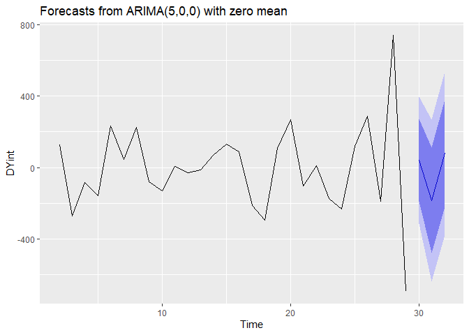<!-- -->

``` r
print(summary(fcast))
```

    ## 
    ## Forecast method: ARIMA(5,0,0) with zero mean
    ## 
    ## Model Information:
    ## Series: DYint 
    ## ARIMA(5,0,0) with zero mean 
    ## 
    ## Coefficients:
    ##           ar1      ar2      ar3      ar4      ar5
    ##       -0.7946  -0.4558  -0.6206  -0.7829  -0.5411
    ## s.e.   0.1620   0.2278   0.1730   0.1854   0.2125
    ## 
    ## sigma^2 estimated as 32811:  log likelihood=-184.27
    ## AIC=380.53   AICc=384.53   BIC=388.52
    ## 
    ## Error measures:
    ##                     ME     RMSE      MAE     MPE     MAPE     MASE      ACF1
    ## Training set -9.999187 164.1709 130.4651 65.0792 298.6644 0.490402 -0.043742
    ## 
    ## Forecasts:
    ##    Point Forecast     Lo 80    Hi 80     Lo 95    Hi 95
    ## 30       41.00802 -191.1305 273.1466 -314.0173 396.0333
    ## 31     -183.71492 -480.2114 112.7816 -637.1671 269.7373
    ## 32       80.49330 -218.7912 379.7778 -377.2228 538.2094

#### Forecast workload for next day with confidence 95% is 397 pallets.

# NARROW

``` r
Ynar <- ts(df_prod[,5])
autoplot(Ynar) + ggtitle("Time Series Plot : NARROW") + ylab("Sum of Pallets")
```

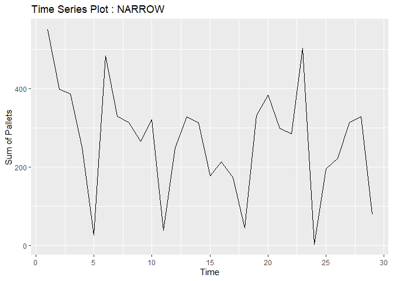<!-- -->
#### As we can see, the data had a trend so we will made new data with
added differencing method.

``` r
DYnar <- diff(Ynar)
autoplot(DYnar) + ggtitle("Time Series Plot : NARROW with diff") + ylab("Sum of Pallets")
```

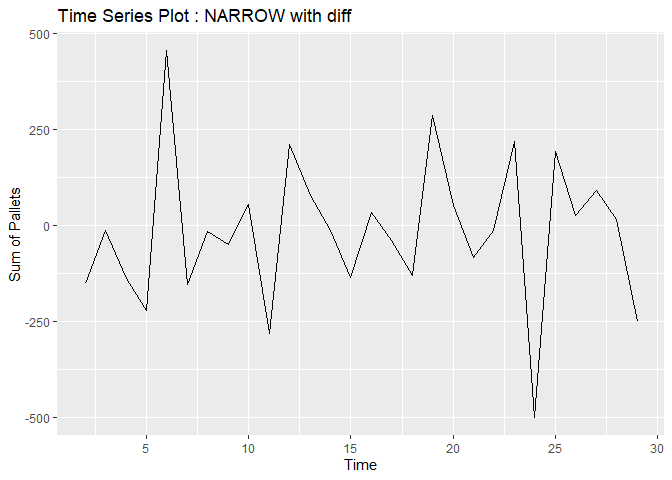<!-- -->
#### The data didn’t have seasonal. So we could go to next step for
determine best model.

``` r
fit <- naive(DYnar)
print(summary(fit))
```

    ## 
    ## Forecast method: Naive method
    ## 
    ## Model Information:
    ## Call: naive(y = DYnar) 
    ## 
    ## Residual sd: 318.7254 
    ## 
    ## Error measures:
    ##                     ME     RMSE      MAE       MPE     MAPE MASE       ACF1
    ## Training set -3.592593 318.7254 240.1111 -15.43925 302.2317    1 -0.6211844
    ## 
    ## Forecasts:
    ##    Point Forecast      Lo 80     Hi 80      Lo 95     Hi 95
    ## 30           -249  -657.4631  159.4631  -873.6903  375.6903
    ## 31           -249  -826.6540  328.6540 -1132.4455  634.4455
    ## 32           -249  -956.4788  458.4788 -1330.9954  832.9954
    ## 33           -249 -1065.9261  567.9261 -1498.3807 1000.3807
    ## 34           -249 -1162.3512  664.3512 -1645.8500 1147.8500
    ## 35           -249 -1249.5261  751.5261 -1779.1726 1281.1726
    ## 36           -249 -1329.6917  831.6917 -1901.7753 1403.7753
    ## 37           -249 -1404.3080  906.3080 -2015.8911 1517.8911
    ## 38           -249 -1474.3892  976.3892 -2123.0710 1625.0710
    ## 39           -249 -1540.6736 1042.6736 -2224.4443 1726.4443

``` r
checkresiduals(fit)
```

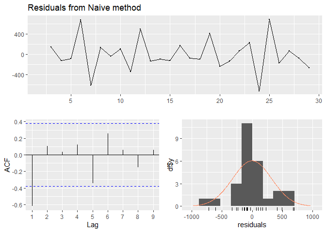<!-- -->

    ## 
    ##  Ljung-Box test
    ## 
    ## data:  Residuals from Naive method
    ## Q* = 19.231, df = 6, p-value = 0.00379
    ## 
    ## Model df: 0.   Total lags used: 6

``` r
## Residuals = 319

fit_ets <- ets(Ynar)
print(summary(fit_ets))
```

    ## ETS(M,N,N) 
    ## 
    ## Call:
    ##  ets(y = Ynar) 
    ## 
    ##   Smoothing parameters:
    ##     alpha = 0.0815 
    ## 
    ##   Initial states:
    ##     l = 304.7504 
    ## 
    ##   sigma:  0.4949
    ## 
    ##      AIC     AICc      BIC 
    ## 389.6720 390.6320 393.7739 
    ## 
    ## Training set error measures:
    ##                     ME     RMSE      MAE       MPE    MAPE      MASE
    ## Training set -21.98114 140.1774 106.8587 -334.0034 354.247 0.7673871
    ##                     ACF1
    ## Training set -0.05882794

``` r
checkresiduals(fit_ets)
```

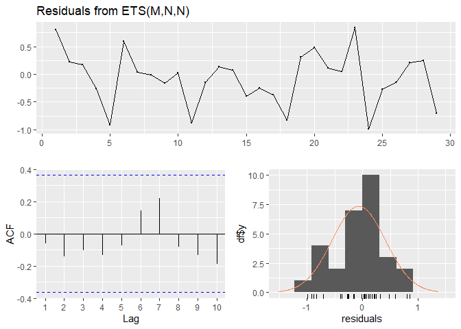<!-- -->

    ## 
    ##  Ljung-Box test
    ## 
    ## data:  Residuals from ETS(M,N,N)
    ## Q* = 2.769, df = 4, p-value = 0.5972
    ## 
    ## Model df: 2.   Total lags used: 6

``` r
## Residuals = 141

fit_arima <- auto.arima(DYnar, d=0, D=0, stepwise = FALSE, approximation = FALSE, trace = TRUE)
```

    ## 
    ##  ARIMA(0,0,0) with zero mean     : 374.9054
    ##  ARIMA(0,0,0) with non-zero mean : 377.0069
    ##  ARIMA(0,0,1) with zero mean     : 363.5515
    ##  ARIMA(0,0,1) with non-zero mean : Inf
    ##  ARIMA(0,0,2) with zero mean     : 366.0704
    ##  ARIMA(0,0,2) with non-zero mean : Inf
    ##  ARIMA(0,0,3) with zero mean     : 368.3514
    ##  ARIMA(0,0,3) with non-zero mean : Inf
    ##  ARIMA(0,0,4) with zero mean     : 370.9155
    ##  ARIMA(0,0,4) with non-zero mean : Inf
    ##  ARIMA(0,0,5) with zero mean     : 374.2351
    ##  ARIMA(0,0,5) with non-zero mean : Inf
    ##  ARIMA(1,0,0) with zero mean     : 371.263
    ##  ARIMA(1,0,0) with non-zero mean : 373.4562
    ##  ARIMA(1,0,1) with zero mean     : 366.0706
    ##  ARIMA(1,0,1) with non-zero mean : Inf
    ##  ARIMA(1,0,2) with zero mean     : Inf
    ##  ARIMA(1,0,2) with non-zero mean : Inf
    ##  ARIMA(1,0,3) with zero mean     : 371.0632
    ##  ARIMA(1,0,3) with non-zero mean : Inf
    ##  ARIMA(1,0,4) with zero mean     : 374.1296
    ##  ARIMA(1,0,4) with non-zero mean : Inf
    ##  ARIMA(2,0,0) with zero mean     : 370.9493
    ##  ARIMA(2,0,0) with non-zero mean : 373.2621
    ##  ARIMA(2,0,1) with zero mean     : 368.5785
    ##  ARIMA(2,0,1) with non-zero mean : Inf
    ##  ARIMA(2,0,2) with zero mean     : 370.7768
    ##  ARIMA(2,0,2) with non-zero mean : Inf
    ##  ARIMA(2,0,3) with zero mean     : Inf
    ##  ARIMA(2,0,3) with non-zero mean : Inf
    ##  ARIMA(3,0,0) with zero mean     : 372.652
    ##  ARIMA(3,0,0) with non-zero mean : 375.1513
    ##  ARIMA(3,0,1) with zero mean     : 371.2719
    ##  ARIMA(3,0,1) with non-zero mean : Inf
    ##  ARIMA(3,0,2) with zero mean     : 373.8208
    ##  ARIMA(3,0,2) with non-zero mean : Inf
    ##  ARIMA(4,0,0) with zero mean     : 374.6992
    ##  ARIMA(4,0,0) with non-zero mean : 377.4779
    ##  ARIMA(4,0,1) with zero mean     : 373.5868
    ##  ARIMA(4,0,1) with non-zero mean : Inf
    ##  ARIMA(5,0,0) with zero mean     : 372.6809
    ##  ARIMA(5,0,0) with non-zero mean : 375.001
    ## 
    ## 
    ## 
    ##  Best model: ARIMA(0,0,1) with zero mean

``` r
print(summary(fit_arima))
```

    ## Series: DYnar 
    ## ARIMA(0,0,1) with zero mean 
    ## 
    ## Coefficients:
    ##           ma1
    ##       -0.9082
    ## s.e.   0.1331
    ## 
    ## sigma^2 estimated as 21171:  log likelihood=-179.54
    ## AIC=363.07   AICc=363.55   BIC=365.74
    ## 
    ## Training set error measures:
    ##                     ME     RMSE     MAE      MPE     MAPE      MASE        ACF1
    ## Training set -50.39227 142.8822 110.373 83.67381 134.7339 0.4596746 -0.06983265

``` r
checkresiduals(fit_arima)
```

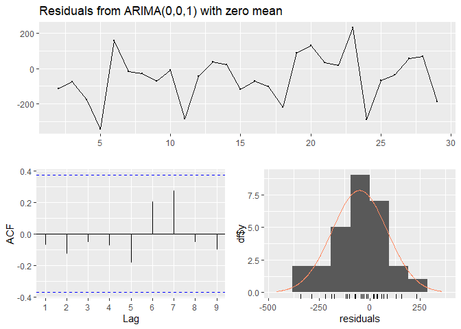<!-- -->

    ## 
    ##  Ljung-Box test
    ## 
    ## data:  Residuals from ARIMA(0,0,1) with zero mean
    ## Q* = 3.7225, df = 5, p-value = 0.59
    ## 
    ## Model df: 1.   Total lags used: 6

``` r
## Residuals = 145
## Residuals diff 2 = 154
```

#### The best model for this one is Exponential Smoothing, since the model had smallest residuals.

``` r
fcast <- forecast(fit_ets, h=3)
autoplot(fcast)
```

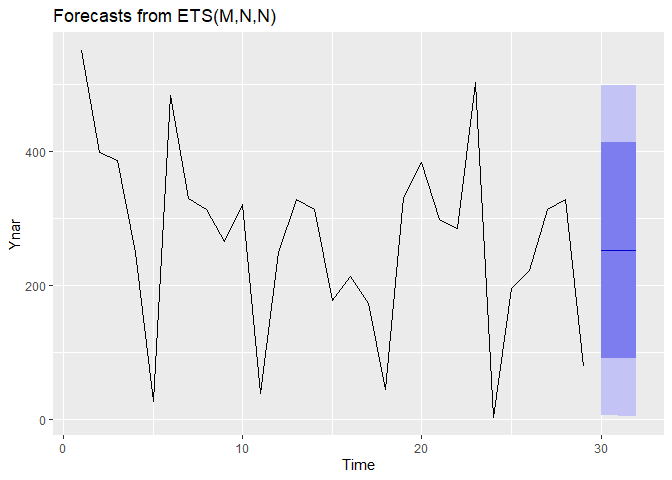<!-- -->

``` r
print(summary(fcast))
```

    ## 
    ## Forecast method: ETS(M,N,N)
    ## 
    ## Model Information:
    ## ETS(M,N,N) 
    ## 
    ## Call:
    ##  ets(y = Ynar) 
    ## 
    ##   Smoothing parameters:
    ##     alpha = 0.0815 
    ## 
    ##   Initial states:
    ##     l = 304.7504 
    ## 
    ##   sigma:  0.4949
    ## 
    ##      AIC     AICc      BIC 
    ## 389.6720 390.6320 393.7739 
    ## 
    ## Error measures:
    ##                     ME     RMSE      MAE       MPE    MAPE      MASE
    ## Training set -21.98114 140.1774 106.8587 -334.0034 354.247 0.7673871
    ##                     ACF1
    ## Training set -0.05882794
    ## 
    ## Forecasts:
    ##    Point Forecast    Lo 80    Hi 80    Lo 95    Hi 95
    ## 30       252.7992 92.46699 413.1315 7.592221 498.0062
    ## 31       252.7992 91.80548 413.7930 6.580543 499.0179
    ## 32       252.7992 91.14562 414.4528 5.571370 500.0271

#### Forecast workload for next day with confidence 95% is 498 pallets.

# NARROW-OUT

``` r
Ynao <- ts(df_prod[,6])
autoplot(Ynao) + ggtitle("Time Series Plot : NARROW-OUT") + ylab("Sum of Pallets")
```

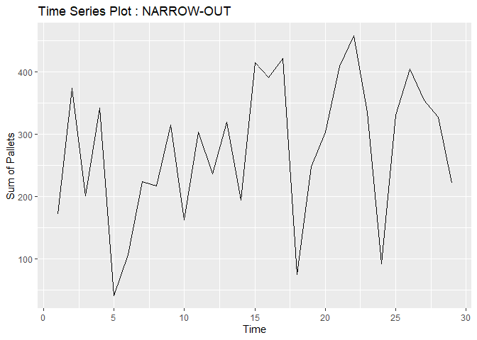<!-- -->
#### As we can see, the data had a trend so we will made new data with
added differencing method.

``` r
DYnao <- diff(Ynao)
autoplot(DYnao) + ggtitle("Time Series Plot : NARROW-OUT with diff") + ylab("Sum of Pallets")
```

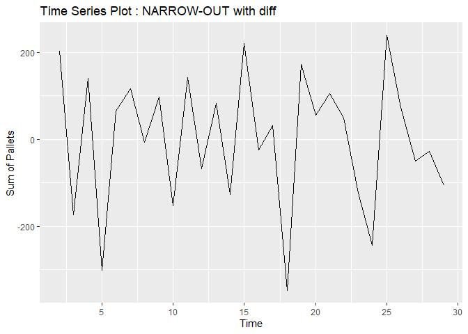<!-- -->
#### The data didn’t have seasonal. So we could go to next step for
determine best model.

``` r
fit <- naive(DYnao)
print(summary(fit))
```

    ## 
    ## Forecast method: Naive method
    ## 
    ## Model Information:
    ## Call: naive(y = DYnao) 
    ## 
    ## Residual sd: 258.2393 
    ## 
    ## Error measures:
    ##                     ME     RMSE      MAE      MPE     MAPE MASE       ACF1
    ## Training set -11.44444 258.2393 215.7407 221.8123 268.5806    1 -0.6632595
    ## 
    ## Forecasts:
    ##    Point Forecast      Lo 80    Hi 80      Lo 95     Hi 95
    ## 30           -106  -436.9469 224.9469  -612.1397  400.1397
    ## 31           -106  -574.0296 362.0296  -821.7896  609.7896
    ## 32           -106  -679.2169 467.2169  -982.6596  770.6596
    ## 33           -106  -767.8939 555.8939 -1118.2793  906.2793
    ## 34           -106  -846.0198 634.0198 -1237.7627 1025.7627
    ## 35           -106  -916.6511 704.6511 -1345.7839 1133.7839
    ## 36           -106  -981.6033 769.6033 -1445.1197 1233.1197
    ## 37           -106 -1042.0593 830.0593 -1537.5791 1325.5791
    ## 38           -106 -1098.8408 886.8408 -1624.4190 1412.4190
    ## 39           -106 -1152.5461 940.5461 -1706.5541 1494.5541

``` r
checkresiduals(fit)
```

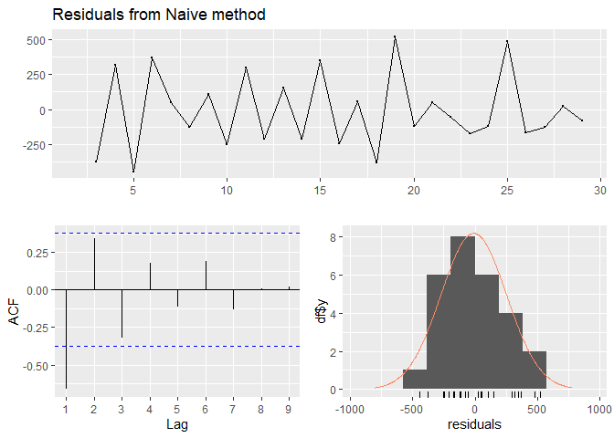<!-- -->

    ## 
    ##  Ljung-Box test
    ## 
    ## data:  Residuals from Naive method
    ## Q* = 23.229, df = 6, p-value = 0.0007231
    ## 
    ## Model df: 0.   Total lags used: 6

``` r
## Residuals = 258

fit_ets <- ets(Ynao)
print(summary(fit_ets))
```

    ## ETS(M,N,N) 
    ## 
    ## Call:
    ##  ets(y = Ynao) 
    ## 
    ##   Smoothing parameters:
    ##     alpha = 0.1506 
    ## 
    ##   Initial states:
    ##     l = 252.3288 
    ## 
    ##   sigma:  0.4395
    ## 
    ##      AIC     AICc      BIC 
    ## 376.8314 377.7914 380.9333 
    ## 
    ## Training set error measures:
    ##                    ME     RMSE      MAE       MPE     MAPE      MASE       ACF1
    ## Training set 11.77107 114.3812 93.50058 -34.66927 62.90946 0.7385095 -0.0304693

``` r
checkresiduals(fit_ets)
```

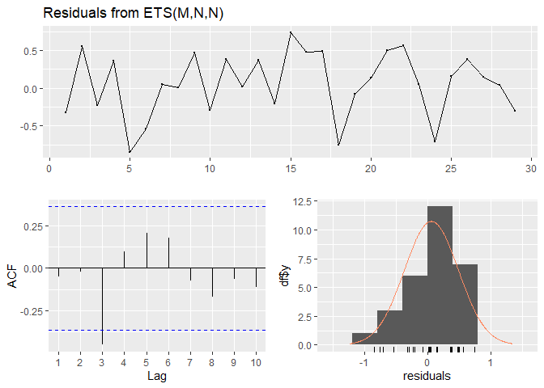<!-- -->

    ## 
    ##  Ljung-Box test
    ## 
    ## data:  Residuals from ETS(M,N,N)
    ## Q* = 10.451, df = 4, p-value = 0.03348
    ## 
    ## Model df: 2.   Total lags used: 6

``` r
## Residuals = 115

fit_arima <- auto.arima(DYnao, d=0, D=0, stepwise = FALSE, approximation = FALSE, trace = TRUE)
```

    ## 
    ##  ARIMA(0,0,0) with zero mean     : 363.0274
    ##  ARIMA(0,0,0) with non-zero mean : 365.3495
    ##  ARIMA(0,0,1) with zero mean     : 351.481
    ##  ARIMA(0,0,1) with non-zero mean : Inf
    ##  ARIMA(0,0,2) with zero mean     : 353.9491
    ##  ARIMA(0,0,2) with non-zero mean : Inf
    ##  ARIMA(0,0,3) with zero mean     : 356.6401
    ##  ARIMA(0,0,3) with non-zero mean : Inf
    ##  ARIMA(0,0,4) with zero mean     : 354.5678
    ##  ARIMA(0,0,4) with non-zero mean : Inf
    ##  ARIMA(0,0,5) with zero mean     : 357.6135
    ##  ARIMA(0,0,5) with non-zero mean : Inf
    ##  ARIMA(1,0,0) with zero mean     : 359.3538
    ##  ARIMA(1,0,0) with non-zero mean : 361.872
    ##  ARIMA(1,0,1) with zero mean     : 353.9517
    ##  ARIMA(1,0,1) with non-zero mean : Inf
    ##  ARIMA(1,0,2) with zero mean     : 356.507
    ##  ARIMA(1,0,2) with non-zero mean : Inf
    ##  ARIMA(1,0,3) with zero mean     : 357.6112
    ##  ARIMA(1,0,3) with non-zero mean : Inf
    ##  ARIMA(1,0,4) with zero mean     : 357.7495
    ##  ARIMA(1,0,4) with non-zero mean : Inf
    ##  ARIMA(2,0,0) with zero mean     : 361.6924
    ##  ARIMA(2,0,0) with non-zero mean : 364.4281
    ##  ARIMA(2,0,1) with zero mean     : 356.6336
    ##  ARIMA(2,0,1) with non-zero mean : Inf
    ##  ARIMA(2,0,2) with zero mean     : 358.8136
    ##  ARIMA(2,0,2) with non-zero mean : Inf
    ##  ARIMA(2,0,3) with zero mean     : Inf
    ##  ARIMA(2,0,3) with non-zero mean : Inf
    ##  ARIMA(3,0,0) with zero mean     : 355.6691
    ##  ARIMA(3,0,0) with non-zero mean : 358.6216
    ##  ARIMA(3,0,1) with zero mean     : 352.4765
    ##  ARIMA(3,0,1) with non-zero mean : Inf
    ##  ARIMA(3,0,2) with zero mean     : Inf
    ##  ARIMA(3,0,2) with non-zero mean : Inf
    ##  ARIMA(4,0,0) with zero mean     : 353.5541
    ##  ARIMA(4,0,0) with non-zero mean : 356.555
    ##  ARIMA(4,0,1) with zero mean     : 354.8143
    ##  ARIMA(4,0,1) with non-zero mean : Inf
    ##  ARIMA(5,0,0) with zero mean     : 354.5209
    ##  ARIMA(5,0,0) with non-zero mean : 357.4728
    ## 
    ## 
    ## 
    ##  Best model: ARIMA(0,0,1) with zero mean

``` r
print(summary(fit_arima))
```

    ## Series: DYnao 
    ## ARIMA(0,0,1) with zero mean 
    ## 
    ## Coefficients:
    ##           ma1
    ##       -0.8785
    ## s.e.   0.1008
    ## 
    ## sigma^2 estimated as 13886:  log likelihood=-173.5
    ## AIC=351   AICc=351.48   BIC=353.67
    ## 
    ## Training set error measures:
    ##                    ME    RMSE      MAE      MPE     MAPE      MASE         ACF1
    ## Training set 21.78474 115.716 96.05438 36.82666 116.9731 0.4452306 -0.002699795

``` r
checkresiduals(fit_arima)
```

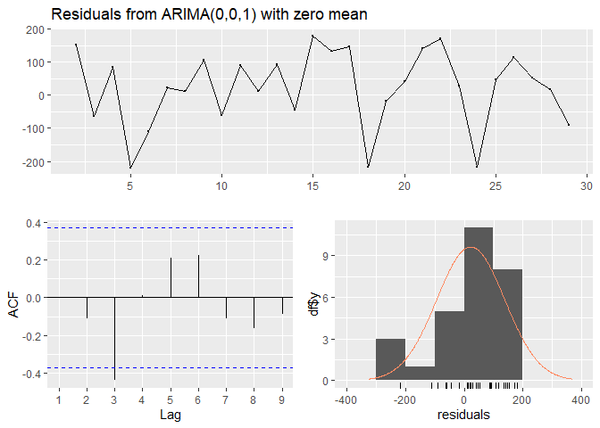<!-- -->

    ## 
    ##  Ljung-Box test
    ## 
    ## data:  Residuals from ARIMA(0,0,1) with zero mean
    ## Q* = 10.456, df = 5, p-value = 0.0633
    ## 
    ## Model df: 1.   Total lags used: 6

``` r
## Residuals = 118
## Residuals diff 2 = 137
```

#### The best model for this one is Exponential Smoothing, since the model had smallest residuals.

``` r
fcast <- forecast(fit_ets, h=3)
autoplot(fcast)
```

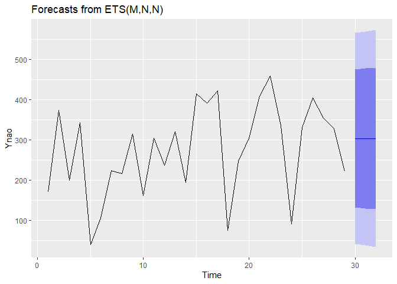<!-- -->

``` r
print(summary(fcast))
```

    ## 
    ## Forecast method: ETS(M,N,N)
    ## 
    ## Model Information:
    ## ETS(M,N,N) 
    ## 
    ## Call:
    ##  ets(y = Ynao) 
    ## 
    ##   Smoothing parameters:
    ##     alpha = 0.1506 
    ## 
    ##   Initial states:
    ##     l = 252.3288 
    ## 
    ##   sigma:  0.4395
    ## 
    ##      AIC     AICc      BIC 
    ## 376.8314 377.7914 380.9333 
    ## 
    ## Error measures:
    ##                    ME     RMSE      MAE       MPE     MAPE      MASE       ACF1
    ## Training set 11.77107 114.3812 93.50058 -34.66927 62.90946 0.7385095 -0.0304693
    ## 
    ## Forecasts:
    ##    Point Forecast    Lo 80    Hi 80    Lo 95    Hi 95
    ## 30       303.7399 132.6573 474.8225 42.09159 565.3881
    ## 31       303.7399 130.3576 477.1221 38.57465 568.9051
    ## 32       303.7399 128.0783 479.4014 35.08864 572.3911

#### Forecast workload for next day with confidence 95% is 565 pallets.

# NARROW-RPL

``` r
Ynarp <- ts(df_prod[,7])
autoplot(Ynarp) + ggtitle("Time Series Plot : NARROW-RPL") + ylab("Sum of Pallets")
```

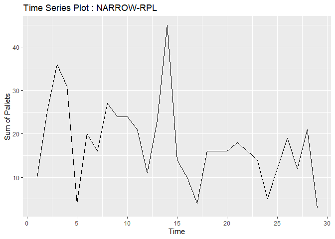<!-- -->
#### As we can see, the data had a trend so we will made new data with
added differencing method.

``` r
DYnarp <- diff(Ynarp)
autoplot(DYnarp) + ggtitle("Time Series Plot : NARROW-RPL with diff") + ylab("Sum of Pallets")
```

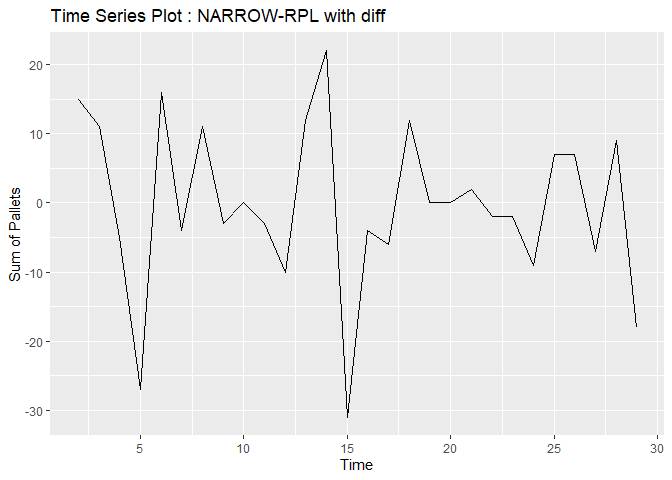<!-- -->
#### The data didn’t have seasonal. So we could go to next step for
determine best model.

``` r
fit <- naive(DYnarp)
print(summary(fit))
```

    ## 
    ## Forecast method: Naive method
    ## 
    ## Model Information:
    ## Call: naive(y = DYnarp) 
    ## 
    ## Residual sd: 18.8493 
    ## 
    ## Error measures:
    ##                     ME    RMSE      MAE MPE MAPE MASE       ACF1
    ## Training set -1.222222 18.8493 13.96296 NaN  Inf    1 -0.5140908
    ## 
    ## Forecasts:
    ##    Point Forecast     Lo 80     Hi 80      Lo 95    Hi 95
    ## 30            -18 -42.15636  6.156356  -54.94396 18.94396
    ## 31            -18 -52.16225 16.162247  -70.24665 34.24665
    ## 32            -18 -59.84004 23.840036  -81.98881 45.98881
    ## 33            -18 -66.31271 30.312712  -91.88792 55.88792
    ## 34            -18 -72.01525 36.015255 -100.60920 64.60920
    ## 35            -18 -77.17075 41.170747 -108.49385 72.49385
    ## 36            -18 -81.91171 45.911711 -115.74453 79.74453
    ## 37            -18 -86.32449 50.324493 -122.49330 86.49330
    ## 38            -18 -90.46907 54.469069 -128.83188 92.83188
    ## 39            -18 -94.38911 58.389106 -134.82706 98.82706

``` r
checkresiduals(fit)
```

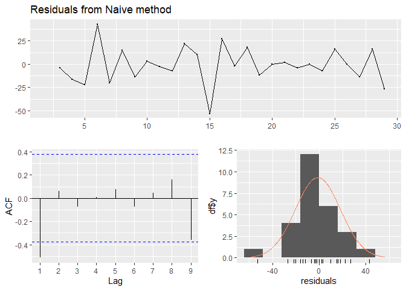<!-- -->

    ## 
    ##  Ljung-Box test
    ## 
    ## data:  Residuals from Naive method
    ## Q* = 8.6652, df = 6, p-value = 0.1933
    ## 
    ## Model df: 0.   Total lags used: 6

``` r
## Residuals = 19

fit_ets <- ets(Ynarp)
print(summary(fit_ets))
```

    ## ETS(M,N,N) 
    ## 
    ## Call:
    ##  ets(y = Ynarp) 
    ## 
    ##   Smoothing parameters:
    ##     alpha = 0.2265 
    ## 
    ##   Initial states:
    ##     l = 23.1859 
    ## 
    ##   sigma:  0.4887
    ## 
    ##      AIC     AICc      BIC 
    ## 230.6277 231.5877 234.7296 
    ## 
    ## Training set error measures:
    ##                     ME    RMSE      MAE       MPE    MAPE      MASE        ACF1
    ## Training set -1.600123 9.71009 7.156168 -64.77056 83.4509 0.7857754 0.001605747

``` r
checkresiduals(fit_ets)
```

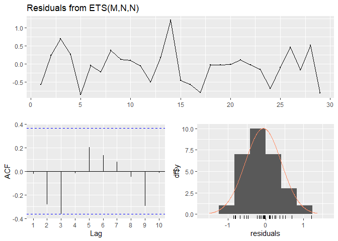<!-- -->

    ## 
    ##  Ljung-Box test
    ## 
    ## data:  Residuals from ETS(M,N,N)
    ## Q* = 9.4343, df = 4, p-value = 0.05112
    ## 
    ## Model df: 2.   Total lags used: 6

``` r
## Residuals = 10

fit_arima <- auto.arima(DYnarp, d=0, D=0, stepwise = FALSE, approximation = FALSE, trace = TRUE)
```

    ## 
    ##  ARIMA(0,0,0) with zero mean     : 220.8316
    ##  ARIMA(0,0,0) with non-zero mean : 223.1456
    ##  ARIMA(0,0,1) with zero mean     : 212.3392
    ##  ARIMA(0,0,1) with non-zero mean : Inf
    ##  ARIMA(0,0,2) with zero mean     : 214.2699
    ##  ARIMA(0,0,2) with non-zero mean : Inf
    ##  ARIMA(0,0,3) with zero mean     : 215.1882
    ##  ARIMA(0,0,3) with non-zero mean : Inf
    ##  ARIMA(0,0,4) with zero mean     : 215.244
    ##  ARIMA(0,0,4) with non-zero mean : Inf
    ##  ARIMA(0,0,5) with zero mean     : 218.4894
    ##  ARIMA(0,0,5) with non-zero mean : Inf
    ##  ARIMA(1,0,0) with zero mean     : 221.0566
    ##  ARIMA(1,0,0) with non-zero mean : 223.5586
    ##  ARIMA(1,0,1) with zero mean     : 214.5161
    ##  ARIMA(1,0,1) with non-zero mean : Inf
    ##  ARIMA(1,0,2) with zero mean     : 216.9186
    ##  ARIMA(1,0,2) with non-zero mean : Inf
    ##  ARIMA(1,0,3) with zero mean     : Inf
    ##  ARIMA(1,0,3) with non-zero mean : Inf
    ##  ARIMA(1,0,4) with zero mean     : 218.506
    ##  ARIMA(1,0,4) with non-zero mean : Inf
    ##  ARIMA(2,0,0) with zero mean     : 221.398
    ##  ARIMA(2,0,0) with non-zero mean : 224.0633
    ##  ARIMA(2,0,1) with zero mean     : 215.3222
    ##  ARIMA(2,0,1) with non-zero mean : Inf
    ##  ARIMA(2,0,2) with zero mean     : 215.2461
    ##  ARIMA(2,0,2) with non-zero mean : Inf
    ##  ARIMA(2,0,3) with zero mean     : Inf
    ##  ARIMA(2,0,3) with non-zero mean : Inf
    ##  ARIMA(3,0,0) with zero mean     : 217.6902
    ##  ARIMA(3,0,0) with non-zero mean : 220.3838
    ##  ARIMA(3,0,1) with zero mean     : 214.9358
    ##  ARIMA(3,0,1) with non-zero mean : Inf
    ##  ARIMA(3,0,2) with zero mean     : 217.4868
    ##  ARIMA(3,0,2) with non-zero mean : Inf
    ##  ARIMA(4,0,0) with zero mean     : 217.0408
    ##  ARIMA(4,0,0) with non-zero mean : 219.8487
    ##  ARIMA(4,0,1) with zero mean     : 217.7064
    ##  ARIMA(4,0,1) with non-zero mean : Inf
    ##  ARIMA(5,0,0) with zero mean     : 218.8104
    ##  ARIMA(5,0,0) with non-zero mean : 221.5541
    ## 
    ## 
    ## 
    ##  Best model: ARIMA(0,0,1) with zero mean

``` r
print(summary(fit_arima))
```

    ## Series: DYnarp 
    ## ARIMA(0,0,1) with zero mean 
    ## 
    ## Coefficients:
    ##           ma1
    ##       -0.8649
    ## s.e.   0.0962
    ## 
    ## sigma^2 estimated as 96.82:  log likelihood=-103.93
    ## AIC=211.86   AICc=212.34   BIC=214.52
    ## 
    ## Training set error measures:
    ##                     ME     RMSE      MAE MPE MAPE      MASE      ACF1
    ## Training set -1.331623 9.662178 7.306235 NaN  Inf 0.5232582 0.1075793

``` r
checkresiduals(fit_arima)
```

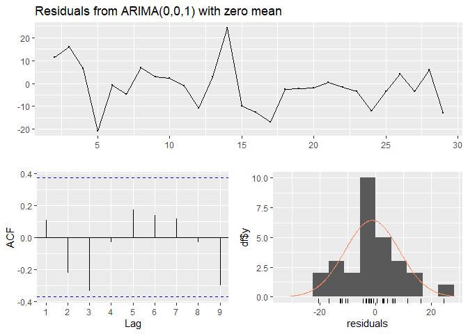<!-- -->

    ## 
    ##  Ljung-Box test
    ## 
    ## data:  Residuals from ARIMA(0,0,1) with zero mean
    ## Q* = 7.571, df = 5, p-value = 0.1815
    ## 
    ## Model df: 1.   Total lags used: 6

``` r
## Residuals = 10
## Residuals diff 2 = 14
```

#### The best model for this one is Exponential Smoothing, since the model had smallest residuals.

``` r
fcast <- forecast(fit_ets, h=3)
autoplot(fcast)
```

<!-- -->

``` r
print(summary(fcast))
```

    ## 
    ## Forecast method: ETS(M,N,N)
    ## 
    ## Model Information:
    ## ETS(M,N,N) 
    ## 
    ## Call:
    ##  ets(y = Ynarp) 
    ## 
    ##   Smoothing parameters:
    ##     alpha = 0.2265 
    ## 
    ##   Initial states:
    ##     l = 23.1859 
    ## 
    ##   sigma:  0.4887
    ## 
    ##      AIC     AICc      BIC 
    ## 230.6277 231.5877 234.7296 
    ## 
    ## Error measures:
    ##                     ME    RMSE      MAE       MPE    MAPE      MASE        ACF1
    ## Training set -1.600123 9.71009 7.156168 -64.77056 83.4509 0.7857754 0.001605747
    ## 
    ## Forecasts:
    ##    Point Forecast    Lo 80    Hi 80      Lo 95    Hi 95
    ## 30        12.6768 4.737214 20.61640  0.5342484 24.81936
    ## 31        12.6768 4.488860 20.86475  0.1544231 25.19919
    ## 32        12.6768 4.244910 21.10870 -0.2186663 25.57228

#### Forecast workload for next day with confidence 95% is 25 pallets.

# O-PND-OUT

``` r
Ypnd <- ts(df_prod[,8])
autoplot(Ypnd) + ggtitle("Time Series Plot : O-PND-OUT") + ylab("Sum of Pallets")
```

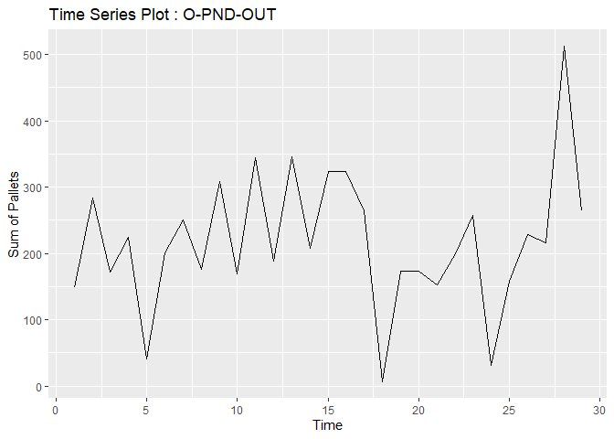<!-- -->
#### As we can see, the data had a trend so we will made new data with
added differencing method.

``` r
DYpnd <- diff(Ypnd)
autoplot(DYpnd) + ggtitle("Time Series Plot : O-PND-OUT with diff") + ylab("Sum of Pallets")
```

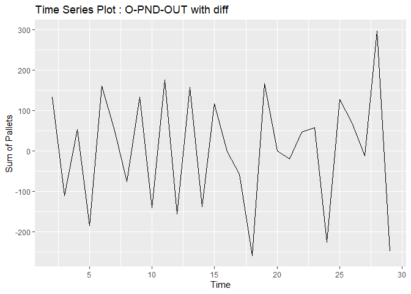<!-- -->
#### The data didn’t have seasonal. So we could go to next step for
determine best model.

``` r
fit <- naive(DYpnd)
print(summary(fit))
```

    ## 
    ## Forecast method: Naive method
    ## 
    ## Model Information:
    ## Call: naive(y = DYpnd) 
    ## 
    ## Residual sd: 253.9513 
    ## 
    ## Error measures:
    ##                     ME     RMSE      MAE  MPE MAPE MASE      ACF1
    ## Training set -14.14815 253.9513 218.6667 -Inf  Inf    1 -0.690966
    ## 
    ## Forecasts:
    ##    Point Forecast      Lo 80     Hi 80      Lo 95     Hi 95
    ## 30           -248  -573.4517  77.45168  -745.7354  249.7354
    ## 31           -248  -708.2582 212.25818  -951.9041  455.9041
    ## 32           -248  -811.6988 315.69884 -1110.1030  614.1030
    ## 33           -248  -898.9034 402.90335 -1243.4708  747.4708
    ## 34           -248  -975.7321 479.73207 -1360.9702  864.9702
    ## 35           -248 -1045.1905 549.19055 -1467.1977  971.1977
    ## 36           -248 -1109.0642 613.06420 -1564.8841 1068.8841
    ## 37           -248 -1168.5164 672.51635 -1655.8083 1159.8083
    ## 38           -248 -1224.3550 728.35503 -1741.2062 1245.2062
    ## 39           -248 -1277.1686 781.16857 -1821.9775 1325.9775

``` r
checkresiduals(fit)
```

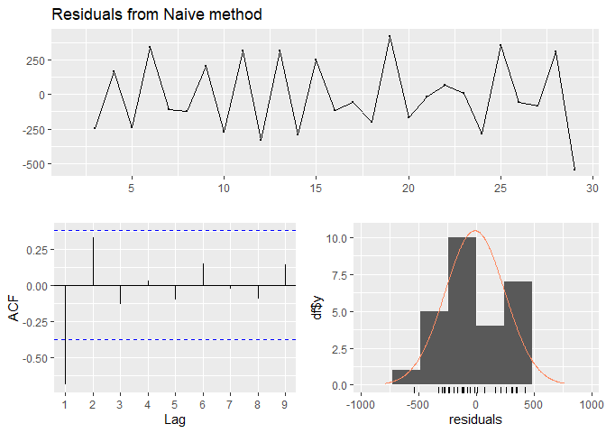<!-- -->

    ## 
    ##  Ljung-Box test
    ## 
    ## data:  Residuals from Naive method
    ## Q* = 19.524, df = 6, p-value = 0.003364
    ## 
    ## Model df: 0.   Total lags used: 6

``` r
## Residuals = 254

fit_ets <- ets(Ypnd)
print(summary(fit_ets))
```

    ## ETS(A,N,N) 
    ## 
    ## Call:
    ##  ets(y = Ypnd) 
    ## 
    ##   Smoothing parameters:
    ##     alpha = 1e-04 
    ## 
    ##   Initial states:
    ##     l = 218.9088 
    ## 
    ##   sigma:  104.7219
    ## 
    ##      AIC     AICc      BIC 
    ## 371.3552 372.3152 375.4570 
    ## 
    ## Training set error measures:
    ##                        ME     RMSE      MAE       MPE     MAPE      MASE
    ## Training set -0.002563295 101.0463 74.92224 -139.8402 161.6204 0.6226841
    ##                   ACF1
    ## Training set 0.0170433

``` r
checkresiduals(fit_ets)
```

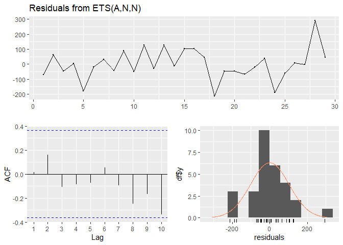<!-- -->

    ## 
    ##  Ljung-Box test
    ## 
    ## data:  Residuals from ETS(A,N,N)
    ## Q* = 1.8482, df = 4, p-value = 0.7637
    ## 
    ## Model df: 2.   Total lags used: 6

``` r
## Residuals = 101

fit_arima <- auto.arima(DYpnd, d=0, D=0, stepwise = FALSE, approximation = FALSE, trace = TRUE)
```

    ## 
    ##  ARIMA(0,0,0) with zero mean     : 359.6585
    ##  ARIMA(0,0,0) with non-zero mean : 361.9616
    ##  ARIMA(0,0,1) with zero mean     : Inf
    ##  ARIMA(0,0,1) with non-zero mean : Inf
    ##  ARIMA(0,0,2) with zero mean     : Inf
    ##  ARIMA(0,0,2) with non-zero mean : Inf
    ##  ARIMA(0,0,3) with zero mean     : Inf
    ##  ARIMA(0,0,3) with non-zero mean : Inf
    ##  ARIMA(0,0,4) with zero mean     : Inf
    ##  ARIMA(0,0,4) with non-zero mean : Inf
    ##  ARIMA(0,0,5) with zero mean     : Inf
    ##  ARIMA(0,0,5) with non-zero mean : Inf
    ##  ARIMA(1,0,0) with zero mean     : 348.5265
    ##  ARIMA(1,0,0) with non-zero mean : 350.8402
    ##  ARIMA(1,0,1) with zero mean     : 350.1401
    ##  ARIMA(1,0,1) with non-zero mean : 352.5409
    ##  ARIMA(1,0,2) with zero mean     : Inf
    ##  ARIMA(1,0,2) with non-zero mean : Inf
    ##  ARIMA(1,0,3) with zero mean     : Inf
    ##  ARIMA(1,0,3) with non-zero mean : Inf
    ##  ARIMA(1,0,4) with zero mean     : Inf
    ##  ARIMA(1,0,4) with non-zero mean : Inf
    ##  ARIMA(2,0,0) with zero mean     : 350.5736
    ##  ARIMA(2,0,0) with non-zero mean : 353.0604
    ##  ARIMA(2,0,1) with zero mean     : Inf
    ##  ARIMA(2,0,1) with non-zero mean : Inf
    ##  ARIMA(2,0,2) with zero mean     : Inf
    ##  ARIMA(2,0,2) with non-zero mean : Inf
    ##  ARIMA(2,0,3) with zero mean     : Inf
    ##  ARIMA(2,0,3) with non-zero mean : Inf
    ##  ARIMA(3,0,0) with zero mean     : 353.0668
    ##  ARIMA(3,0,0) with non-zero mean : 355.7859
    ##  ARIMA(3,0,1) with zero mean     : Inf
    ##  ARIMA(3,0,1) with non-zero mean : Inf
    ##  ARIMA(3,0,2) with zero mean     : Inf
    ##  ARIMA(3,0,2) with non-zero mean : Inf
    ##  ARIMA(4,0,0) with zero mean     : 355.284
    ##  ARIMA(4,0,0) with non-zero mean : 358.2113
    ##  ARIMA(4,0,1) with zero mean     : Inf
    ##  ARIMA(4,0,1) with non-zero mean : Inf
    ##  ARIMA(5,0,0) with zero mean     : 357.093
    ##  ARIMA(5,0,0) with non-zero mean : 360.314
    ## 
    ## 
    ## 
    ##  Best model: ARIMA(1,0,0) with zero mean

``` r
print(summary(fit_arima))
```

    ## Series: DYpnd 
    ## ARIMA(1,0,0) with zero mean 
    ## 
    ## Coefficients:
    ##           ar1
    ##       -0.6482
    ## s.e.   0.1510
    ## 
    ## sigma^2 estimated as 12918:  log likelihood=-172.02
    ## AIC=348.05   AICc=348.53   BIC=350.71
    ## 
    ## Training set error measures:
    ##                   ME     RMSE      MAE MPE MAPE      MASE        ACF1
    ## Training set 11.3693 111.6106 83.32734 Inf  Inf 0.3810702 -0.09373473

``` r
checkresiduals(fit_arima)
```

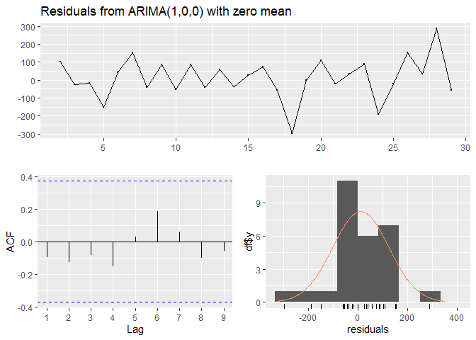<!-- -->

    ## 
    ##  Ljung-Box test
    ## 
    ## data:  Residuals from ARIMA(1,0,0) with zero mean
    ## Q* = 3.1879, df = 5, p-value = 0.671
    ## 
    ## Model df: 1.   Total lags used: 6

``` r
## Residuals = 114
## Residuals diff 2 = 147
```

#### The best model for this one is Exponential Smoothing, since the model had smallest residuals.

``` r
fcast <- forecast(fit_ets, h=3)
autoplot(fcast)
```

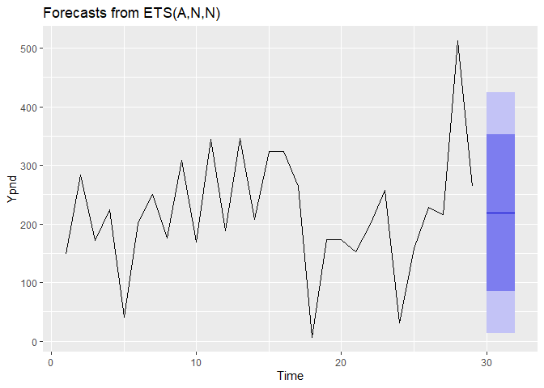<!-- -->

``` r
print(summary(fcast))
```

    ## 
    ## Forecast method: ETS(A,N,N)
    ## 
    ## Model Information:
    ## ETS(A,N,N) 
    ## 
    ## Call:
    ##  ets(y = Ypnd) 
    ## 
    ##   Smoothing parameters:
    ##     alpha = 1e-04 
    ## 
    ##   Initial states:
    ##     l = 218.9088 
    ## 
    ##   sigma:  104.7219
    ## 
    ##      AIC     AICc      BIC 
    ## 371.3552 372.3152 375.4570 
    ## 
    ## Error measures:
    ##                        ME     RMSE      MAE       MPE     MAPE      MASE
    ## Training set -0.002563295 101.0463 74.92224 -139.8402 161.6204 0.6226841
    ##                   ACF1
    ## Training set 0.0170433
    ## 
    ## Forecasts:
    ##    Point Forecast    Lo 80    Hi 80    Lo 95  Hi 95
    ## 30       218.9088 84.70227 353.1153 13.65763 424.16
    ## 31       218.9088 84.70227 353.1153 13.65763 424.16
    ## 32       218.9088 84.70227 353.1153 13.65763 424.16

#### Forecast workload for next day with confidence 95% is 425 pallets.

# OUT-CONT

``` r
Youc <- ts(df_prod[,9])
autoplot(Youc) + ggtitle("Time Series Plot : OUT-CONT") + ylab("Sum of Pallets")
```

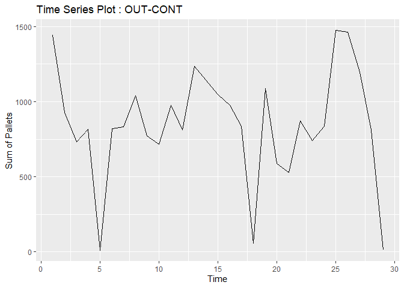<!-- -->
#### As we can see, the data had a trend so we will made new data with
added differencing method.

``` r
DYouc <- diff(Youc)
autoplot(DYouc) + ggtitle("Time Series Plot : OUT-CONT with diff") + ylab("Sum of Pallets")
```

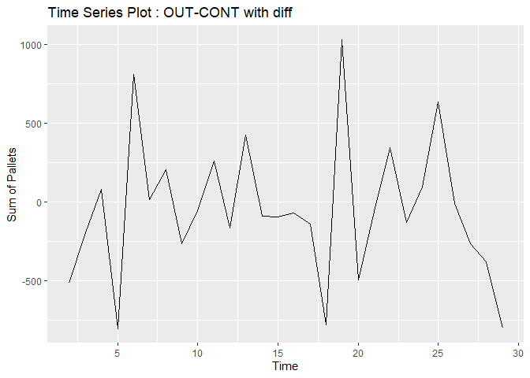<!-- -->
#### The data didn’t have seasonal. So we could go to next step for
determine best model.

``` r
fit <- naive(DYouc)
print(summary(fit))
```

    ## 
    ## Forecast method: Naive method
    ## 
    ## Model Information:
    ## Call: naive(y = DYouc) 
    ## 
    ## Residual sd: 694.5216 
    ## 
    ## Error measures:
    ##                     ME     RMSE      MAE      MPE     MAPE MASE       ACF1
    ## Training set -10.59259 694.5216 525.9259 77.28885 625.8602    1 -0.6524871
    ## 
    ## Forecasts:
    ##    Point Forecast     Lo 80      Hi 80     Lo 95     Hi 95
    ## 30           -801 -1691.065   89.06528 -2162.237  560.2374
    ## 31           -801 -2059.742  457.74240 -2726.080 1124.0804
    ## 32           -801 -2342.638  740.63829 -3158.732 1556.7323
    ## 33           -801 -2581.131  979.13057 -3523.475 1921.4748
    ## 34           -801 -2791.246 1189.24648 -3844.819 2242.8193
    ## 35           -801 -2981.206 1379.20578 -4135.337 2533.3370
    ## 36           -801 -3155.891 1553.89139 -4402.496 2800.4956
    ## 37           -801 -3318.485 1716.48479 -4651.161 3049.1607
    ## 38           -801 -3471.196 1869.19585 -4884.712 3282.7122
    ## 39           -801 -3615.634 2013.63356 -5105.611 3503.6106

``` r
checkresiduals(fit)
```

<!-- -->

    ## 
    ##  Ljung-Box test
    ## 
    ## data:  Residuals from Naive method
    ## Q* = 16.166, df = 6, p-value = 0.01289
    ## 
    ## Model df: 0.   Total lags used: 6

``` r
## Residuals = 695

fit_ets <- ets(Youc)
print(summary(fit_ets))
```

    ## ETS(M,N,N) 
    ## 
    ## Call:
    ##  ets(y = Youc) 
    ## 
    ##   Smoothing parameters:
    ##     alpha = 1e-04 
    ## 
    ##   Initial states:
    ##     l = 857.3272 
    ## 
    ##   sigma:  0.4434
    ## 
    ##      AIC     AICc      BIC 
    ## 446.1352 447.0952 450.2371 
    ## 
    ## Training set error measures:
    ##                    ME     RMSE      MAE       MPE     MAPE     MASE      ACF1
    ## Training set -1.77574 366.8369 259.4213 -561.1944 581.7563 0.787062 0.1761386

``` r
checkresiduals(fit_ets)
```

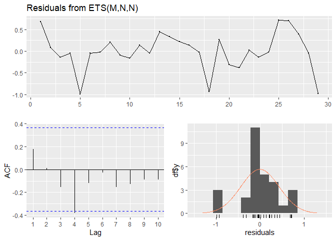<!-- -->

    ## 
    ##  Ljung-Box test
    ## 
    ## data:  Residuals from ETS(M,N,N)
    ## Q* = 7.7206, df = 4, p-value = 0.1024
    ## 
    ## Model df: 2.   Total lags used: 6

``` r
## Residuals = 367

fit_arima <- auto.arima(DYouc, d=0, D=0, stepwise = FALSE, approximation = FALSE, trace = TRUE)
```

    ## 
    ##  ARIMA(0,0,0) with zero mean     : 422.2396
    ##  ARIMA(0,0,0) with non-zero mean : 424.1833
    ##  ARIMA(0,0,1) with zero mean     : 421.3631
    ##  ARIMA(0,0,1) with non-zero mean : 423.5213
    ##  ARIMA(0,0,2) with zero mean     : Inf
    ##  ARIMA(0,0,2) with non-zero mean : Inf
    ##  ARIMA(0,0,3) with zero mean     : Inf
    ##  ARIMA(0,0,3) with non-zero mean : Inf
    ##  ARIMA(0,0,4) with zero mean     : Inf
    ##  ARIMA(0,0,4) with non-zero mean : Inf
    ##  ARIMA(0,0,5) with zero mean     : Inf
    ##  ARIMA(0,0,5) with non-zero mean : Inf
    ##  ARIMA(1,0,0) with zero mean     : 421.5831
    ##  ARIMA(1,0,0) with non-zero mean : 423.6433
    ##  ARIMA(1,0,1) with zero mean     : Inf
    ##  ARIMA(1,0,1) with non-zero mean : 426.309
    ##  ARIMA(1,0,2) with zero mean     : Inf
    ##  ARIMA(1,0,2) with non-zero mean : Inf
    ##  ARIMA(1,0,3) with zero mean     : Inf
    ##  ARIMA(1,0,3) with non-zero mean : Inf
    ##  ARIMA(1,0,4) with zero mean     : Inf
    ##  ARIMA(1,0,4) with non-zero mean : Inf
    ##  ARIMA(2,0,0) with zero mean     : 423.9938
    ##  ARIMA(2,0,0) with non-zero mean : 426.2856
    ##  ARIMA(2,0,1) with zero mean     : Inf
    ##  ARIMA(2,0,1) with non-zero mean : Inf
    ##  ARIMA(2,0,2) with zero mean     : Inf
    ##  ARIMA(2,0,2) with non-zero mean : Inf
    ##  ARIMA(2,0,3) with zero mean     : Inf
    ##  ARIMA(2,0,3) with non-zero mean : Inf
    ##  ARIMA(3,0,0) with zero mean     : 426.5219
    ##  ARIMA(3,0,0) with non-zero mean : 429.0087
    ##  ARIMA(3,0,1) with zero mean     : Inf
    ##  ARIMA(3,0,1) with non-zero mean : Inf
    ##  ARIMA(3,0,2) with zero mean     : Inf
    ##  ARIMA(3,0,2) with non-zero mean : Inf
    ##  ARIMA(4,0,0) with zero mean     : 426.4768
    ##  ARIMA(4,0,0) with non-zero mean : 429.6014
    ##  ARIMA(4,0,1) with zero mean     : Inf
    ##  ARIMA(4,0,1) with non-zero mean : Inf
    ##  ARIMA(5,0,0) with zero mean     : 426.2693
    ##  ARIMA(5,0,0) with non-zero mean : 429.8154
    ## 
    ## 
    ## 
    ##  Best model: ARIMA(0,0,1) with zero mean

``` r
print(summary(fit_arima))
```

    ## Series: DYouc 
    ## ARIMA(0,0,1) with zero mean 
    ## 
    ## Coefficients:
    ##           ma1
    ##       -0.4747
    ## s.e.   0.4903
    ## 
    ## sigma^2 estimated as 175967:  log likelihood=-208.44
    ## AIC=420.88   AICc=421.36   BIC=423.55
    ## 
    ## Training set error measures:
    ##                     ME     RMSE      MAE      MPE     MAPE      MASE       ACF1
    ## Training set -58.84209 411.9257 314.7755 33.45541 252.2418 0.5985169 0.05961721

``` r
checkresiduals(fit_arima)
```

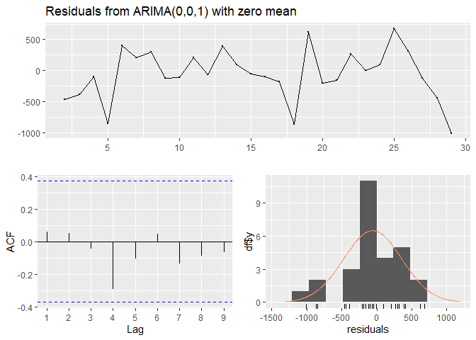<!-- -->

    ## 
    ##  Ljung-Box test
    ## 
    ## data:  Residuals from ARIMA(0,0,1) with zero mean
    ## Q* = 3.7237, df = 5, p-value = 0.5898
    ## 
    ## Model df: 1.   Total lags used: 6

``` r
## Residuals = 420
## Residuals diff 2 = 475
```

#### The best model for this one is Exponential Smoothing, since the model had smallest residuals.

``` r
fcast <- forecast(fit_ets, h=3)
autoplot(fcast)
```

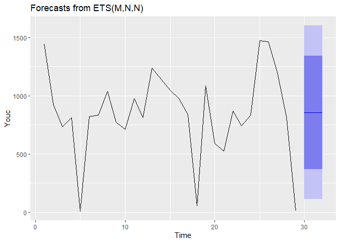<!-- -->

``` r
print(summary(fcast))
```

    ## 
    ## Forecast method: ETS(M,N,N)
    ## 
    ## Model Information:
    ## ETS(M,N,N) 
    ## 
    ## Call:
    ##  ets(y = Youc) 
    ## 
    ##   Smoothing parameters:
    ##     alpha = 1e-04 
    ## 
    ##   Initial states:
    ##     l = 857.3272 
    ## 
    ##   sigma:  0.4434
    ## 
    ##      AIC     AICc      BIC 
    ## 446.1352 447.0952 450.2371 
    ## 
    ## Error measures:
    ##                    ME     RMSE      MAE       MPE     MAPE     MASE      ACF1
    ## Training set -1.77574 366.8369 259.4213 -561.1944 581.7563 0.787062 0.1761386
    ## 
    ## Forecasts:
    ##    Point Forecast    Lo 80    Hi 80    Lo 95    Hi 95
    ## 30        857.322 370.1171 1344.527 112.2064 1602.438
    ## 31        857.322 370.1171 1344.527 112.2064 1602.438
    ## 32        857.322 370.1171 1344.527 112.2064 1602.438

#### Forecast workload for next day with confidence 95% is 1602 pallets.

# OUTBOUND

``` r
Youb <- ts(df_prod[,10])
autoplot(Youb) + ggtitle("Time Series Plot : OUTBOUND") + ylab("Sum of Pallets")
```

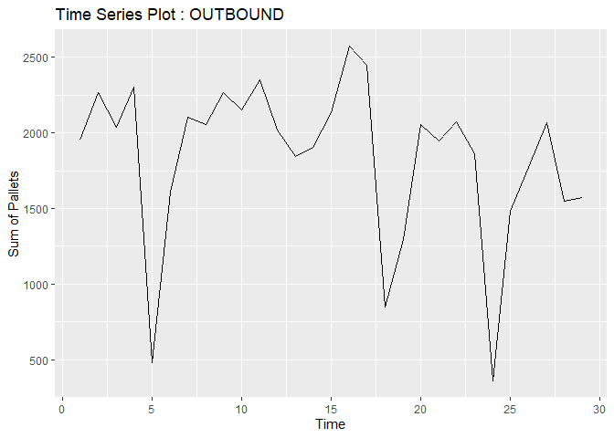<!-- -->
#### As we can see, the data had a trend so we will made new data with
added differencing method.

``` r
DYoub <- diff(Youb)
autoplot(DYoub) + ggtitle("Time Series Plot : OUTBOUND with diff") + ylab("Sum of Pallets")
```

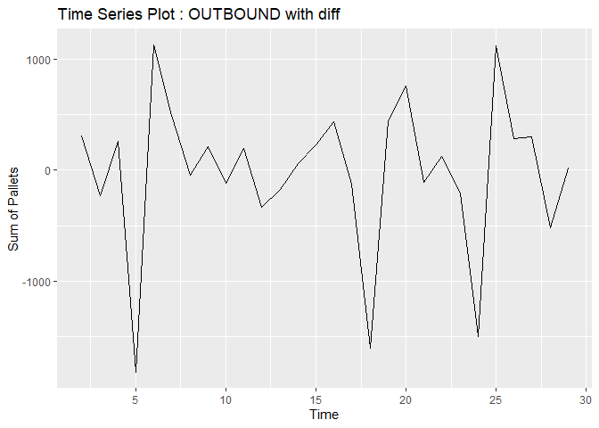<!-- -->
#### The data didn’t have seasonal. So we could go to next step for
determine best model.

``` r
fit <- naive(DYoub)
print(summary(fit))
```

    ## 
    ## Forecast method: Naive method
    ## 
    ## Model Information:
    ## Call: naive(y = DYoub) 
    ## 
    ## Residual sd: 1103.563 
    ## 
    ## Error measures:
    ##                     ME     RMSE      MAE      MPE     MAPE MASE     ACF1
    ## Training set -10.81481 1103.563 792.2222 293.5623 331.4458    1 -0.52496
    ## 
    ## Forecasts:
    ##    Point Forecast     Lo 80    Hi 80     Lo 95    Hi 95
    ## 30             21 -1393.273 1435.273 -2141.944 2183.944
    ## 31             21 -1979.084 2021.084 -3037.864 3079.864
    ## 32             21 -2428.592 2470.592 -3725.328 3767.328
    ## 33             21 -2807.546 2849.546 -4304.887 4346.887
    ## 34             21 -3141.410 3183.410 -4815.489 4857.489
    ## 35             21 -3443.247 3485.247 -5277.108 5319.108
    ## 36             21 -3720.814 3762.814 -5701.611 5743.611
    ## 37             21 -3979.168 4021.168 -6096.729 6138.729
    ## 38             21 -4221.819 4263.819 -6467.831 6509.831
    ## 39             21 -4451.324 4493.324 -6818.829 6860.829

``` r
checkresiduals(fit)
```

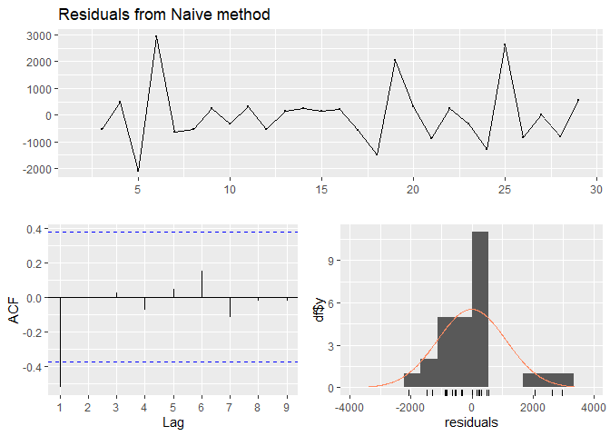<!-- -->

    ## 
    ##  Ljung-Box test
    ## 
    ## data:  Residuals from Naive method
    ## Q* = 9.4454, df = 6, p-value = 0.15
    ## 
    ## Model df: 0.   Total lags used: 6

``` r
## Residuals = 1104

fit_ets <- ets(Youb)
print(summary(fit_ets))
```

    ## ETS(M,N,N) 
    ## 
    ## Call:
    ##  ets(y = Youb) 
    ## 
    ##   Smoothing parameters:
    ##     alpha = 0.1494 
    ## 
    ##   Initial states:
    ##     l = 1926.8547 
    ## 
    ##   sigma:  0.2844
    ## 
    ##      AIC     AICc      BIC 
    ## 466.3225 467.2825 470.4244 
    ## 
    ## Training set error measures:
    ##                     ME     RMSE      MAE       MPE     MAPE      MASE      ACF1
    ## Training set -56.75984 543.4486 360.3025 -28.21217 41.87983 0.7657282 0.1164747

``` r
checkresiduals(fit_ets)
```

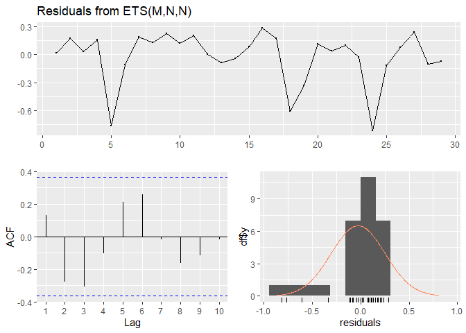<!-- -->

    ## 
    ##  Ljung-Box test
    ## 
    ## data:  Residuals from ETS(M,N,N)
    ## Q* = 10.992, df = 4, p-value = 0.02665
    ## 
    ## Model df: 2.   Total lags used: 6

``` r
## Residuals = 544

fit_arima <- auto.arima(DYoub, d=0, D=0, stepwise = FALSE, approximation = FALSE, trace = TRUE)
```

    ## 
    ##  ARIMA(0,0,0) with zero mean     : 446.7831
    ##  ARIMA(0,0,0) with non-zero mean : 449.0979
    ##  ARIMA(0,0,1) with zero mean     : 438.6939
    ##  ARIMA(0,0,1) with non-zero mean : Inf
    ##  ARIMA(0,0,2) with zero mean     : Inf
    ##  ARIMA(0,0,2) with non-zero mean : Inf
    ##  ARIMA(0,0,3) with zero mean     : 442.0891
    ##  ARIMA(0,0,3) with non-zero mean : Inf
    ##  ARIMA(0,0,4) with zero mean     : 444.425
    ##  ARIMA(0,0,4) with non-zero mean : Inf
    ##  ARIMA(0,0,5) with zero mean     : 447.5224
    ##  ARIMA(0,0,5) with non-zero mean : Inf
    ##  ARIMA(1,0,0) with zero mean     : 446.9381
    ##  ARIMA(1,0,0) with non-zero mean : 449.4298
    ##  ARIMA(1,0,1) with zero mean     : 440.0723
    ##  ARIMA(1,0,1) with non-zero mean : Inf
    ##  ARIMA(1,0,2) with zero mean     : 442.2603
    ##  ARIMA(1,0,2) with non-zero mean : Inf
    ##  ARIMA(1,0,3) with zero mean     : Inf
    ##  ARIMA(1,0,3) with non-zero mean : Inf
    ##  ARIMA(1,0,4) with zero mean     : 447.9643
    ##  ARIMA(1,0,4) with non-zero mean : Inf
    ##  ARIMA(2,0,0) with zero mean     : 446.8771
    ##  ARIMA(2,0,0) with non-zero mean : 449.5782
    ##  ARIMA(2,0,1) with zero mean     : 441.5508
    ##  ARIMA(2,0,1) with non-zero mean : Inf
    ##  ARIMA(2,0,2) with zero mean     : 442.7163
    ##  ARIMA(2,0,2) with non-zero mean : Inf
    ##  ARIMA(2,0,3) with zero mean     : Inf
    ##  ARIMA(2,0,3) with non-zero mean : Inf
    ##  ARIMA(3,0,0) with zero mean     : 446.4911
    ##  ARIMA(3,0,0) with non-zero mean : 449.3944
    ##  ARIMA(3,0,1) with zero mean     : 443.5517
    ##  ARIMA(3,0,1) with non-zero mean : Inf
    ##  ARIMA(3,0,2) with zero mean     : 444.6272
    ##  ARIMA(3,0,2) with non-zero mean : Inf
    ##  ARIMA(4,0,0) with zero mean     : 444.0707
    ##  ARIMA(4,0,0) with non-zero mean : 447.2888
    ##  ARIMA(4,0,1) with zero mean     : 444.9508
    ##  ARIMA(4,0,1) with non-zero mean : 448.3129
    ##  ARIMA(5,0,0) with zero mean     : 443.8636
    ##  ARIMA(5,0,0) with non-zero mean : 447.2046
    ## 
    ## 
    ## 
    ##  Best model: ARIMA(0,0,1) with zero mean

``` r
print(summary(fit_arima))
```

    ## Series: DYoub 
    ## ARIMA(0,0,1) with zero mean 
    ## 
    ## Coefficients:
    ##           ma1
    ##       -0.9098
    ## s.e.   0.1291
    ## 
    ## sigma^2 estimated as 309737:  log likelihood=-217.11
    ## AIC=438.21   AICc=438.69   BIC=440.88
    ## 
    ## Training set error measures:
    ##                    ME     RMSE      MAE       MPE     MAPE      MASE    ACF1
    ## Training set -82.8432 546.5117 362.4153 -27.19084 136.3173 0.4574667 0.14157

``` r
checkresiduals(fit_arima)
```

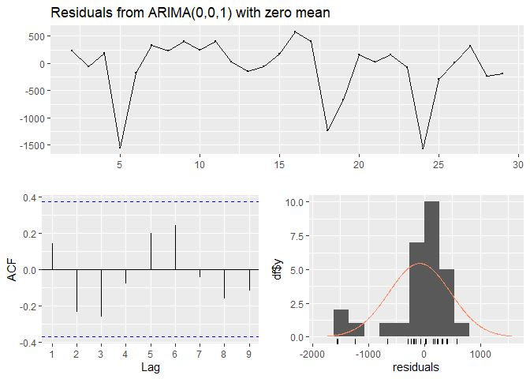<!-- -->

    ## 
    ##  Ljung-Box test
    ## 
    ## data:  Residuals from ARIMA(0,0,1) with zero mean
    ## Q* = 8.5661, df = 5, p-value = 0.1277
    ## 
    ## Model df: 1.   Total lags used: 6

``` r
## Residuals = 557
## Residuals diff 2 = 661
```

#### The best model for this one is Exponential Smoothing, since the model had smallest residuals.

``` r
fcast <- forecast(fit_ets, h=3)
autoplot(fcast)
```

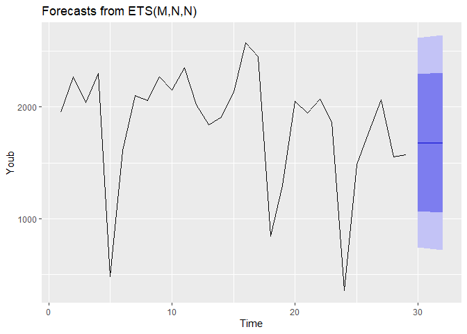<!-- -->

``` r
print(summary(fcast))
```

    ## 
    ## Forecast method: ETS(M,N,N)
    ## 
    ## Model Information:
    ## ETS(M,N,N) 
    ## 
    ## Call:
    ##  ets(y = Youb) 
    ## 
    ##   Smoothing parameters:
    ##     alpha = 0.1494 
    ## 
    ##   Initial states:
    ##     l = 1926.8547 
    ## 
    ##   sigma:  0.2844
    ## 
    ##      AIC     AICc      BIC 
    ## 466.3225 467.2825 470.4244 
    ## 
    ## Error measures:
    ##                     ME     RMSE      MAE       MPE     MAPE      MASE      ACF1
    ## Training set -56.75984 543.4486 360.3025 -28.21217 41.87983 0.7657282 0.1164747
    ## 
    ## Forecasts:
    ##    Point Forecast    Lo 80    Hi 80    Lo 95    Hi 95
    ## 30       1680.943 1068.308 2293.579 743.9984 2617.888
    ## 31       1680.943 1060.962 2300.924 732.7642 2629.123
    ## 32       1680.943 1053.690 2308.197 721.6416 2640.245

#### Forecast workload for next day with confidence 95% is 2617 pallets.

# So the total workload is :

#### INB-PROD 1919 pallets

#### INBOUND 2397 pallets

#### INTERNAL 397 pallets

#### NARROW 498 pallets

#### NARROW-OUT 565 pallets

#### NARROW-RPL 25 pallets

#### O-PND-OUT 425 pallets

#### OUT-CONT 1602 pallets

#### OUTBOUND 2617 pallets
